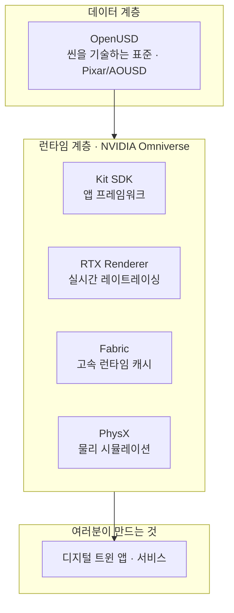
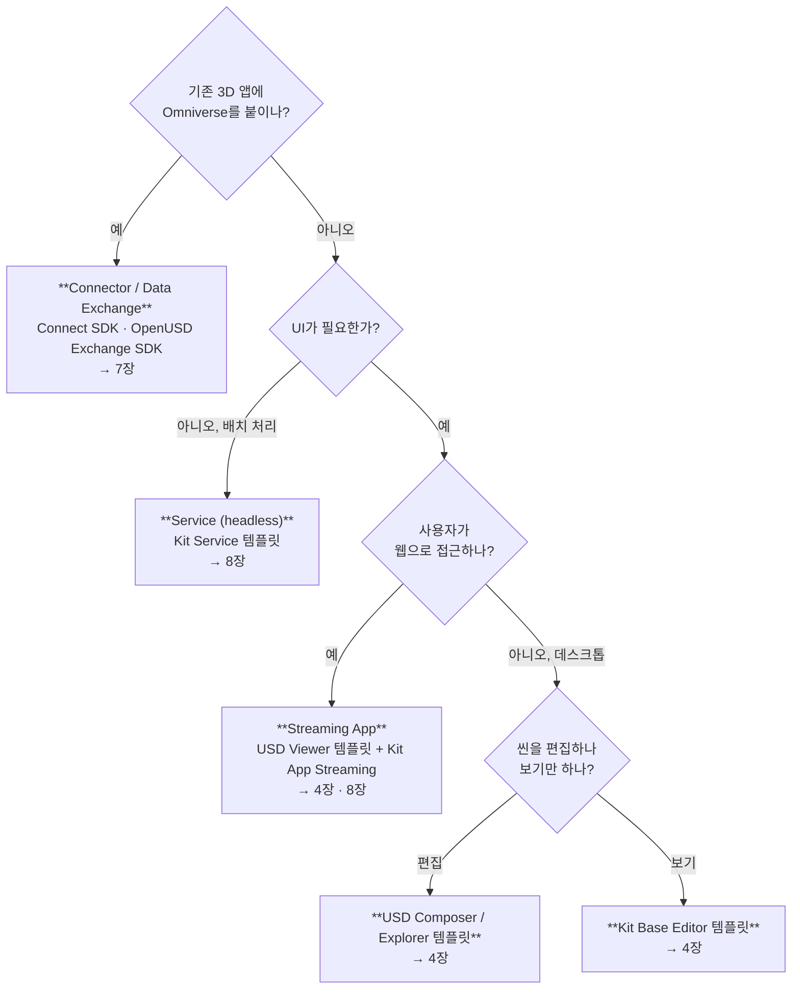
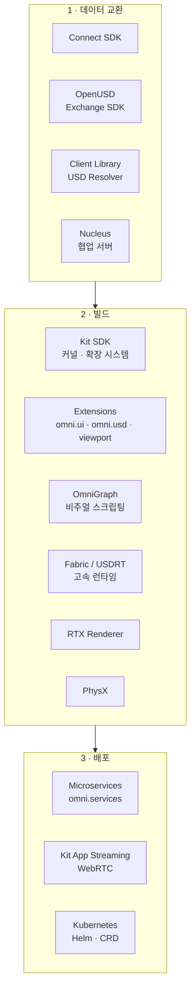
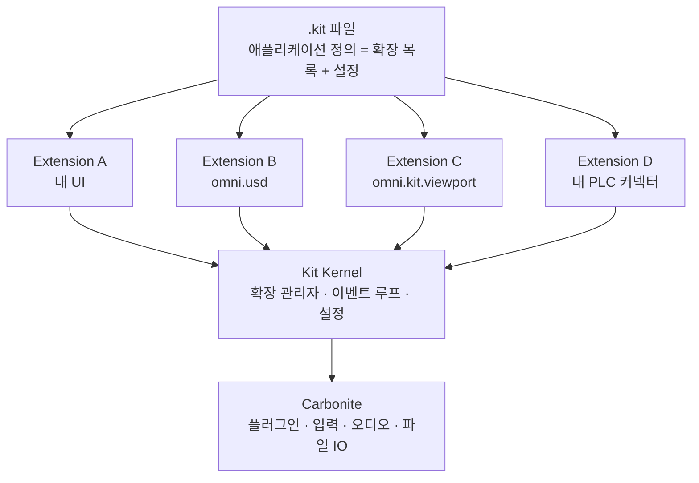
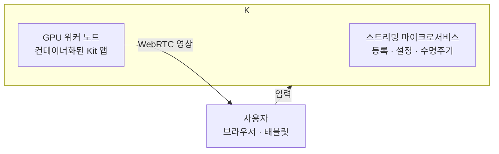
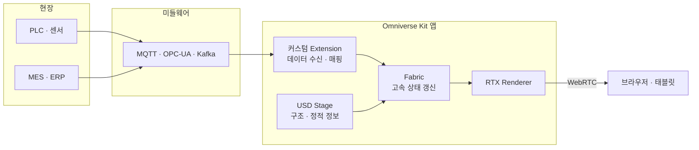

<callout icon="🧭" color="blue_bg">
	**이 문서는** NVIDIA *Omniverse Developer Overview* (https://docs.omniverse.nvidia.com/dev-overview/latest/) 와 그 하위 문서군을 **디지털 트윈을 만들려는 개발자**가 순서대로 읽을 수 있게 재구성한 온보딩 매뉴얼입니다.
	원문은 "무엇이 있는지" 나열하는 카탈로그에 가깝습니다. 이 문서는 **"무엇을 왜 언제 쓰는지"** 순서로 다시 짰습니다.
</callout>

<table_of_contents/>

---

# 0. 먼저, 원문이 왜 어렵게 느껴지는가

이건 여러분 잘못이 아닙니다. 구조적인 이유가 있습니다.

<table fit-page-width="true" header-row="true">
	<tr>
		<td>원인</td>
		<td>구체적으로</td>
		<td>이 문서의 대응</td>
	</tr>
	<tr>
		<td>**문서가 한 곳에 없다**</td>
		<td>dev-overview는 4장짜리 짧은 안내문일 뿐. 실제 내용은 dev-guide, kit-manual, extensions, connect-sdk, usdrt, ovas 등 10개 넘는 별도 사이트에 흩어져 있음</td>
		<td>14장에 **문서 지도**를 만들어 "언제 어느 문서를 보는지" 정리</td>
	</tr>
	<tr>
		<td>**버전이 섞여 있다**</td>
		<td>같은 개념이 Kit 104 / 106 / 107 / 109 문서에 다르게 설명됨. 검색하면 옛날 페이지가 먼저 나옴</td>
		<td>9장에서 버전 체계를 먼저 정리</td>
	</tr>
	<tr>
		<td>**이름이 계속 바뀐다**</td>
		<td>Omniverse Connect → OpenUSD Connections and Data Exchange, Launcher 폐지(2025-10-01), Create → USD Composer</td>
		<td>용어집(13장)에 옛 이름 병기</td>
	</tr>
	<tr>
		<td>**추상 레벨이 널뛴다**</td>
		<td>"플랫폼 개요"에서 갑자기 Carbonite 플러그인 얘기로 점프</td>
		<td>2장(전체 지도) → 3장(Kit) → 4장(실습) 순으로 계단식 구성</td>
	</tr>
	<tr>
		<td>**진입점이 안 보인다**</td>
		<td>"뭘 먼저 설치해서 뭘 먼저 실행하나"가 명확하지 않음</td>
		<td>4장에서 **명령어 단위**로 첫 앱 실행까지</td>
	</tr>
</table>

<callout icon="✅" color="green_bg">
	**읽는 순서 추천**
	처음이면 **0 → 1 → 2 → 4(실습 먼저!) → 3 → 5** 순서를 권합니다. 3장(Kit 아키텍처)은 개념이 추상적이라, 4장에서 앱을 한 번 띄워보고 읽으면 훨씬 빨리 이해됩니다.
</callout>

## 0-1. 이 문서를 다 읽으면 할 수 있는 것

- Omniverse의 구성요소 중 **내 프로젝트에 필요한 것만** 골라낼 수 있다
- `kit-app-template` 으로 **내 디지털 트윈 앱의 뼈대**를 만들 수 있다
- Extension을 만들어 **사내 데이터(PLC, MES, IoT)를 3D 씬에 연결**할 수 있다
- USD를 직접 쓸지 **Fabric을 써야 할지** 판단할 수 있다
- 로컬 실행 / 웹 스트리밍 / K8s 배포 중 **뭘 골라야 할지** 안다
- Feature Branch와 Production Branch 중 **뭘 써야 할지** 안다

## 0-2. 사전 지식

<table fit-page-width="true" header-row="true">
	<tr>
		<td>항목</td>
		<td>필요도</td>
		<td>비고</td>
	</tr>
	<tr>
		<td>OpenUSD 기본 (Stage, Prim, Layer, Composition)</td>
		<td>**필수**</td>
		<td>없으면 여기서 막힙니다. OpenUSD 가이드를 먼저 보세요</td>
	</tr>
	<tr>
		<td>Python</td>
		<td>**필수**</td>
		<td>Extension 개발의 기본 언어</td>
	</tr>
	<tr>
		<td>C++</td>
		<td>선택</td>
		<td>성능 크리티컬한 확장, Carbonite 플러그인</td>
	</tr>
	<tr>
		<td>Docker / Kubernetes</td>
		<td>배포 단계에서만</td>
		<td>8장</td>
	</tr>
	<tr>
		<td>RTX GPU</td>
		<td>**필수**</td>
		<td>RTX 렌더러가 요구. 노트북 내장 그래픽 불가</td>
	</tr>
</table>

## 0-3. 원문 dev-overview의 실제 구조

원문 최상위는 딱 네 장입니다. 생각보다 짧습니다.

<table fit-page-width="true" header-row="true">
	<tr>
		<td>원문 장</td>
		<td>내용</td>
		<td>이 문서</td>
	</tr>
	<tr>
		<td>Introduction</td>
		<td>Omniverse는 무엇인가</td>
		<td>1장</td>
	</tr>
	<tr>
		<td>Platform Overview</td>
		<td>플랫폼 아키텍처와 구성요소</td>
		<td>2장</td>
	</tr>
	<tr>
		<td>Development Paths</td>
		<td>무엇을 만들 것인가에 따른 개발 경로</td>
		<td>1-4, 10장</td>
	</tr>
	<tr>
		<td>Omniverse Releases</td>
		<td>Feature Branch / Production Branch, 배포 위치</td>
		<td>9장</td>
	</tr>
	<tr>
		<td>Additional Resources</td>
		<td>링크 모음</td>
		<td>14~15장</td>
	</tr>
</table>

**나머지 90%의 내용은 여기서 링크로 빠져나가는 하위 문서에 있습니다.** 그게 어렵게 느껴지는 진짜 이유입니다. 이 문서는 그 하위 문서들을 통합했습니다.

---

# 1. Omniverse란 무엇인가

## 1-1. 세 가지 길이의 정의

<callout icon="⏱️" color="gray_bg">
	**30초:** OpenUSD 기반의 3D 애플리케이션과 서비스를 만들기 위한 **개발 플랫폼(SDK + API + 도구 모음)**. 완성된 제품이 아니라 부품 창고에 가깝습니다.
	**3분:** NVIDIA가 제공하는 라이브러리·마이크로서비스 묶음으로, OpenUSD 데이터를 다루고(Data Exchange), 그 위에 앱과 서비스를 만들고(Build), 로컬이나 클라우드에 배포(Deploy)하는 세 가지를 담당합니다. RTX 렌더러, 물리 엔진(PhysX), 실시간 데이터 캐시(Fabric)를 함께 제공합니다.
	**30분:** 2장 전체를 읽으세요.
</callout>

## 1-2. 반드시 버려야 할 오해 5가지

<table fit-page-width="true" header-row="true">
	<tr>
		<td>오해</td>
		<td>사실</td>
	</tr>
	<tr>
		<td>Omniverse는 하나의 프로그램이다</td>
		<td>**아니다.** SDK·라이브러리·서비스의 집합. "Omniverse를 켠다"는 표현 자체가 성립하지 않음</td>
	</tr>
	<tr>
		<td>Omniverse Launcher를 깔면 된다</td>
		<td>**Launcher는 2025년 10월 1일 폐지됐다.** 지금은 GitHub(`kit-app-template`)와 NGC에서 직접 받음</td>
	</tr>
	<tr>
		<td>USD Composer가 곧 Omniverse다</td>
		<td>USD Composer는 Kit SDK로 만든 **레퍼런스 앱 하나**일 뿐. 여러분도 같은 방식으로 앱을 만들 수 있음</td>
	</tr>
	<tr>
		<td>Omniverse를 쓰려면 Nucleus 서버가 필수다</td>
		<td>**아니다.** 로컬 파일만으로도 개발 가능. Nucleus는 협업·라이브싱크용 선택지</td>
	</tr>
	<tr>
		<td>OpenUSD만 알면 Omniverse도 안다</td>
		<td>OpenUSD는 **데이터 포맷/모델**, Omniverse는 그걸 **실행하고 렌더링하고 배포하는 런타임**. 별개의 학습이 필요</td>
	</tr>
</table>

## 1-3. OpenUSD와 Omniverse의 관계



<callout icon="💡" color="yellow_bg">
	**한 줄 정리:** OpenUSD가 "공장을 어떻게 기술할 것인가"라면, Omniverse는 "그걸 어떻게 띄우고 돌리고 배포할 것인가"입니다.
</callout>

## 1-4. 개발 경로 진단 — 나는 무엇을 만들려는가

원문 *Development Paths* 가 던지는 질문을 실무 기준으로 다시 씁니다.



<table fit-page-width="true" header-row="true">
	<tr>
		<td>만들 것</td>
		<td>설명</td>
		<td>주로 쓰는 것</td>
	</tr>
	<tr>
		<td>**Application**</td>
		<td>특정 도메인·워크플로에 맞춘 앱</td>
		<td>Kit SDK, kit-app-template</td>
	</tr>
	<tr>
		<td>**Extension**</td>
		<td>기존 앱의 기능을 확장</td>
		<td>Kit SDK, omni.ui</td>
	</tr>
	<tr>
		<td>**Service**</td>
		<td>헤드리스 USD 처리 (변환, 검증, 렌더팜)</td>
		<td>Kit Service 템플릿, omni.services</td>
	</tr>
	<tr>
		<td>**Data Exchange**</td>
		<td>타사 앱·포맷과 OpenUSD 상호운용</td>
		<td>Connect SDK, OpenUSD Exchange SDK</td>
	</tr>
</table>

---

# 2. 플랫폼 아키텍처 — 전체 지도

## 2-1. 세 가지 기능 축

원문 *Platform Overview* 는 Omniverse를 세 가지 범주로 설명합니다. **이 3분류가 전체 문서를 이해하는 뼈대입니다.**

<table fit-page-width="true" header-row="true">
	<tr>
		<td>축</td>
		<td>하는 일</td>
		<td>대표 구성요소</td>
	</tr>
	<tr>
		<td>**1. OpenUSD Data Exchange**</td>
		<td>USD 데이터를 관리·저작·집계</td>
		<td>Connect SDK, OpenUSD Exchange SDK, Client Library, USD Resolver, Nucleus</td>
	</tr>
	<tr>
		<td>**2. Build Applications & Services**</td>
		<td>SDK와 API로 앱·서비스 개발</td>
		<td>Kit SDK, Extensions, omni.ui, OmniGraph, RTX Renderer, PhysX, Fabric</td>
	</tr>
	<tr>
		<td>**3. Deploy**</td>
		<td>직접 배포하거나 NVIDIA 관리형 서비스 이용</td>
		<td>Kit App Streaming, 컨테이너, Kubernetes, DGX Cloud</td>
	</tr>
</table>

## 2-2. 구성요소 전체 지도



## 2-3. 구성요소별 한 줄 정의 + 언제 만나는가

<table fit-page-width="true" header-row="true">
	<tr>
		<td>구성요소</td>
		<td>한 줄 정의</td>
		<td>디지털 트윈에서 언제</td>
	</tr>
	<tr>
		<td>**Kit SDK**</td>
		<td>OpenUSD 기반 앱·서비스를 Python/C++로 만드는 프레임워크</td>
		<td>거의 항상. 시작점</td>
	</tr>
	<tr>
		<td>**Extension**</td>
		<td>Kit의 모든 기능 단위. 이름+버전을 가진 런타임 로드 패키지</td>
		<td>사내 로직을 붙일 때</td>
	</tr>
	<tr>
		<td>**Carbonite**</td>
		<td>Kit 커널의 저수준 크로스플랫폼 레이어 (입력, 오디오, 플러그인)</td>
		<td>C++ 확장 만들 때만</td>
	</tr>
	<tr>
		<td>**RTX Renderer**</td>
		<td>실시간 레이트레이싱/패스트레이싱 렌더러</td>
		<td>시각화 품질이 중요할 때</td>
	</tr>
	<tr>
		<td>**Fabric / USDRT**</td>
		<td>USD 데이터를 메모리에 캐시해 고속 읽기/쓰기</td>
		<td>실시간 데이터 반영, 대규모 씬</td>
	</tr>
	<tr>
		<td>**PhysX**</td>
		<td>강체·조인트·충돌 물리 엔진</td>
		<td>로봇·물류·기구 시뮬레이션</td>
	</tr>
	<tr>
		<td>**OmniGraph**</td>
		<td>노드 기반 비주얼 스크립팅 (Action Graph / Push Graph)</td>
		<td>이벤트 기반 동작, 비개발자 협업</td>
	</tr>
	<tr>
		<td>**Connect SDK**</td>
		<td>타사 앱용 커넥터를 만드는 개발 키트</td>
		<td>사내 CAD·PLM 연동 개발</td>
	</tr>
	<tr>
		<td>**OpenUSD Exchange SDK**</td>
		<td>일관되고 올바른 USD를 작성하도록 돕는 고수준 라이브러리</td>
		<td>변환기 직접 개발할 때</td>
	</tr>
	<tr>
		<td>**Client Library / USD Resolver**</td>
		<td>`omniverse://` `http://` `file://` 경로 해석과 통신</td>
		<td>Nucleus나 원격 에셋 쓸 때</td>
	</tr>
	<tr>
		<td>**Nucleus**</td>
		<td>USD 협업 서버 (버전 관리, Live Sync)</td>
		<td>여러 팀 동시 작업</td>
	</tr>
	<tr>
		<td>**omni.services**</td>
		<td>Kit을 마이크로서비스로 돌리는 확장군</td>
		<td>배치 변환, 자동 검증 파이프라인</td>
	</tr>
	<tr>
		<td>**Kit App Streaming**</td>
		<td>앱 화면을 WebRTC로 브라우저에 스트리밍</td>
		<td>현장 태블릿·경영진 브라우저 접근</td>
	</tr>
</table>

<callout icon="⚠️" color="orange_bg">
	**전부 배우려 하지 마세요.** 위 표에서 여러분 시나리오에 해당하는 3~4개만 골라서 시작하면 됩니다. 10장에서 시나리오별 조합을 정리해 두었습니다.
</callout>

---

# 3. Kit SDK — 핵심 중의 핵심

## 3-1. 한 문장

<callout icon="🔑" color="purple_bg">
	**Kit에서는 모든 것이 Extension입니다.** 애플리케이션조차 "어떤 Extension을 어떤 설정으로 로드할지 적어둔 목록"에 불과합니다.
</callout>

이 문장 하나가 Kit 아키텍처의 전부입니다. 나머지는 세부사항입니다.

## 3-2. 계층 구조



## 3-3. Extension 이해하기

Extension은 **고유한 이름과 버전을 가지고 런타임에 로드되는 패키지**입니다.

<table fit-page-width="true" header-row="true">
	<tr>
		<td>Extension이 가질 수 있는 것</td>
		<td>설명</td>
	</tr>
	<tr>
		<td>Python 코드</td>
		<td>가장 흔한 형태</td>
	</tr>
	<tr>
		<td>공유 라이브러리 / Carbonite 플러그인</td>
		<td>C++ 구현</td>
	</tr>
	<tr>
		<td>C++ API / Python API</td>
		<td>다른 확장이 쓸 인터페이스</td>
	</tr>
	<tr>
		<td>다른 확장에 대한 의존성</td>
		<td>`extension.toml` 에 선언</td>
	</tr>
	<tr>
		<td>**핫 리로드**</td>
		<td>런타임에 언로드 → 수정 → 재로드 가능</td>
	</tr>
</table>

<callout icon="💡" color="yellow_bg">
	**핫 리로드는 개발 생산성의 핵심입니다.** 앱을 껐다 켜지 않고 코드를 고쳐 바로 확인할 수 있습니다. 익숙해지면 개발 속도가 몇 배 차이 납니다.
</callout>

### Extension의 최소 구조

```
my.company.digitaltwin/
 ├─ config/
 │   └─ extension.toml        ← 이름, 버전, 의존성, 진입점
 └─ my/company/digitaltwin/
     ├─ __init__.py
     └─ extension.py          ← on_startup / on_shutdown
```

```toml
# config/extension.toml
[package]
version = "1.0.0"
title = "Digital Twin Bridge"
description = "PLC 데이터를 USD 씬에 반영"
category = "Simulation"

[dependencies]
"omni.usd" = {}
"omni.ui" = {}
"omni.kit.uiapp" = {}

[[python.module]]
name = "my.company.digitaltwin"
```

```python
# extension.py
import omni.ext
import omni.ui as ui
import omni.usd


class DigitalTwinExtension(omni.ext.IExt):

    def on_startup(self, ext_id):
        self._window = ui.Window("Digital Twin Bridge", width=320, height=200)
        with self._window.frame:
            with ui.VStack(spacing=8):
                ui.Label("설비 상태 브리지")
                ui.Button("PLC 연결", clicked_fn=self._connect)

    def _connect(self):
        stage = omni.usd.get_context().get_stage()
        prim = stage.GetPrimAtPath("/World/Factory/Line_A/Robot_01")
        if prim:
            print("연결 대상:", prim.GetPath())

    def on_shutdown(self):
        self._window = None
```

<callout icon="✅" color="green_bg">
	**이게 Kit 개발의 실질적 시작점입니다.** `on_startup` 에서 UI와 리소스를 만들고, `on_shutdown` 에서 정리합니다. 나머지는 전부 이 구조의 확장입니다.
</callout>

## 3-4. .kit 파일 — 애플리케이션의 정체

`.kit` 파일은 **단일 파일 확장(single-file extension)** 이자, 어떤 확장을 어떤 설정으로 로드할지 적은 **매니페스트**입니다.

```toml
# my_digital_twin.kit
[package]
title = "My Factory Twin"
version = "0.1.0"

[dependencies]
"omni.kit.uiapp" = {}
"omni.usd" = {}
"omni.kit.viewport.bundle" = {}
"omni.kit.window.stage" = {}
"omni.kit.window.property" = {}
"my.company.digitaltwin" = {}          # ← 내가 만든 확장

[settings]
app.window.title = "My Factory Twin"
app.window.width = 1920
app.window.height = 1080
renderer.enabled = "rtx"
```

앱이 시작되면 Kit이 이 목록을 읽고, 각 확장의 의존성을 따라가며 **전체 확장 트리를 펼칩니다.** 그게 곧 애플리케이션입니다.

<callout icon="💡" color="yellow_bg">
	**디지털 트윈 실무 팁:** 하나의 코드베이스에서 `.kit` 파일만 여러 개 만들어 **"현장용 경량 뷰어"**, **"엔지니어용 편집기"**, **"헤드리스 검증 서비스"** 를 각각 만들 수 있습니다. 확장은 공유하고 조합만 바꾸는 것입니다.
</callout>

## 3-5. Kit Kernel과 Carbonite

- **Kit Kernel**: 확장을 발견·로드·관리하고, 이벤트 루프와 설정 시스템을 돌리는 핵심
- **Carbonite SDK**: 입력, 오디오, 파일 I/O, 플러그인 시스템 등 **OS 차이를 흡수하는 저수준 레이어**. Kit Kernel의 기반

Python만 쓴다면 Carbonite를 직접 만질 일은 거의 없습니다. C++ 확장을 만들 때 등장합니다.

---

# 4. 실습 — 첫 Kit 앱 띄우기

<callout icon="🚀" color="green_bg">
	**개념보다 이걸 먼저 하세요.** 앱이 한 번 떠야 3장의 설명이 이해됩니다.
</callout>

## 4-1. 사전 요구사항

<table fit-page-width="true" header-row="true">
	<tr>
		<td>항목</td>
		<td>요구</td>
	</tr>
	<tr>
		<td>GPU</td>
		<td>NVIDIA RTX 계열 (RTX 렌더러 필수). 내장 그래픽 불가</td>
	</tr>
	<tr>
		<td>드라이버</td>
		<td>최신 스튜디오/게임레디 드라이버</td>
	</tr>
	<tr>
		<td>OS</td>
		<td>Windows 10/11 또는 Ubuntu 22.04</td>
	</tr>
	<tr>
		<td>빌드 도구</td>
		<td>Windows: Visual Studio Build Tools / Linux: gcc, make</td>
	</tr>
	<tr>
		<td>Git</td>
		<td>필수</td>
	</tr>
	<tr>
		<td>NVIDIA 개발자 계정</td>
		<td>무료. NGC 접근용</td>
	</tr>
</table>

<callout icon="⚠️" color="red_bg">
	**Omniverse Launcher를 찾지 마세요.** 2025년 10월 1일 폐지됐습니다. 인터넷의 옛 튜토리얼 대부분이 Launcher 기준이라 그대로 따라 하면 막힙니다. 지금의 정답은 아래 `kit-app-template` 입니다.
</callout>

## 4-2. 4단계로 첫 앱 실행

```bash
# 1) 템플릿 저장소 클론
git clone https://github.com/NVIDIA-Omniverse/kit-app-template.git
cd kit-app-template

# 2) 새 애플리케이션 생성 (대화형 프롬프트)
./repo.sh template new           # Windows: .\repo.bat template new

# 3) 빌드
./repo.sh build

# 4) 실행
./repo.sh launch
```

`template new` 를 실행하면 어떤 종류(Application/Extension)와 어떤 템플릿을 쓸지 물어봅니다.

## 4-3. 5가지 애플리케이션 템플릿 — 무엇을 고를까

<table fit-page-width="true" header-row="true">
	<tr>
		<td>템플릿</td>
		<td>설명</td>
		<td>디지털 트윈에서</td>
	</tr>
	<tr>
		<td>**Kit Service**</td>
		<td>UI 없는 최소 서비스. 헤드리스 처리용</td>
		<td>CAD 자동 변환, 씬 검증, 배치 렌더</td>
	</tr>
	<tr>
		<td>**Kit Base Editor**</td>
		<td>USD를 로드·조작·렌더하는 최소 GUI 앱</td>
		<td>**학습 시작점으로 최적.** 커스텀 툴의 뼈대</td>
	</tr>
	<tr>
		<td>**USD Composer**</td>
		<td>복잡한 USD 씬 저작용. 컨피규레이터 등</td>
		<td>공장 레이아웃 편집 도구</td>
	</tr>
	<tr>
		<td>**USD Explorer**</td>
		<td>대규모 USD 씬 탐색·협업용</td>
		<td>완성된 공장 트윈 리뷰, 설계 검토 회의</td>
	</tr>
	<tr>
		<td>**USD Viewer**</td>
		<td>뷰포트만 있는 앱. 원격 스트리밍·웹 임베딩에 최적화</td>
		<td>**경영진·고객용 웹 뷰어.** 현장 태블릿</td>
	</tr>
</table>

<callout icon="🎯" color="green_bg">
	**추천 경로:** 학습은 **Kit Base Editor** 로 시작 → 실제 제품은 시나리오에 따라 **USD Explorer**(내부 검토) 또는 **USD Viewer**(외부 공유) 로 분기.
</callout>

## 4-4. repo 툴 명령어

<table fit-page-width="true" header-row="true">
	<tr>
		<td>명령</td>
		<td>하는 일</td>
	</tr>
	<tr>
		<td>`./repo.sh template new`</td>
		<td>새 앱 또는 확장 생성</td>
	</tr>
	<tr>
		<td>`./repo.sh build`</td>
		<td>빌드 (의존성 내려받고 링크)</td>
	</tr>
	<tr>
		<td>`./repo.sh launch`</td>
		<td>빌드된 앱 실행</td>
	</tr>
	<tr>
		<td>`./repo.sh test`</td>
		<td>확장 테스트 스위트 실행 (기본은 창 없이)</td>
	</tr>
	<tr>
		<td>`./repo.sh package`</td>
		<td>배포용 패키징</td>
	</tr>
</table>

## 4-5. 프로젝트 디렉토리 구조

```
kit-app-template/
 ├─ source/
 │   ├─ apps/
 │   │   └─ my_company.factory_twin.kit      ← 내 앱 정의
 │   └─ extensions/
 │       └─ my_company.factory_twin_setup/   ← 내 확장
 ├─ templates/                                ← 원본 템플릿 (건드리지 않음)
 ├─ tools/                                    ← repo 툴체인
 ├─ _build/                                   ← 빌드 산출물 (git 무시)
 └─ repo.sh / repo.bat
```

<callout icon="✅" color="green_bg">
	**습관:** `source/` 아래만 여러분의 코드입니다. `_build/` 는 언제든 지우고 다시 빌드할 수 있어야 정상입니다.
</callout>

## 4-6. 확장 추가하기

```bash
./repo.sh template new
# → Extension 선택 → Python Extension 선택 → 이름 입력
```

생성 후 `.kit` 파일의 `[dependencies]` 에 확장 이름을 추가해야 앱이 로드합니다. **이 연결을 빠뜨리는 것이 초보자 1순위 실수입니다.**

---

# 5. 핵심 Extension API 지도

실제 개발에서 부딪히는 것들만 추렸습니다.

## 5-1. 자주 쓰는 확장

<table fit-page-width="true" header-row="true">
	<tr>
		<td>확장</td>
		<td>역할</td>
		<td>대표 진입점</td>
	</tr>
	<tr>
		<td>`omni.usd`</td>
		<td>현재 Stage 접근, 이벤트, 선택</td>
		<td>`omni.usd.get_context().get_stage()`</td>
	</tr>
	<tr>
		<td>`omni.ui`</td>
		<td>UI 프레임워크 (Window, VStack, Button, TreeView)</td>
		<td>`omni.ui.Window(...)`</td>
	</tr>
	<tr>
		<td>`omni.kit.viewport`</td>
		<td>3D 뷰포트. 카메라, 픽킹, 오버레이</td>
		<td>`omni.kit.viewport.utility`</td>
	</tr>
	<tr>
		<td>`omni.kit.commands`</td>
		<td>실행 취소 가능한 명령 시스템</td>
		<td>`omni.kit.commands.execute(...)`</td>
	</tr>
	<tr>
		<td>`omni.kit.app`</td>
		<td>앱 수명주기, 프레임 업데이트 구독</td>
		<td>`omni.kit.app.get_app()`</td>
	</tr>
	<tr>
		<td>`omni.kit.menu.utils`</td>
		<td>메뉴 등록</td>
		<td>메뉴 항목 추가</td>
	</tr>
	<tr>
		<td>`carb.settings`</td>
		<td>설정 읽기/쓰기</td>
		<td>`carb.settings.get_settings()`</td>
	</tr>
	<tr>
		<td>`omni.physx`</td>
		<td>물리 시뮬레이션 제어</td>
		<td>시뮬레이션 시작/정지</td>
	</tr>
	<tr>
		<td>`omni.graph.core`</td>
		<td>OmniGraph 노드·그래프</td>
		<td>비주얼 스크립팅</td>
	</tr>
</table>

## 5-2. 실전 패턴 — 매 프레임 씬 갱신하기

디지털 트윈에서 가장 많이 쓰는 패턴입니다. 외부 데이터를 받아 씬에 반영합니다.

```python
import omni.ext
import omni.usd
import omni.kit.app
from pxr import UsdGeom, Gf


class TelemetryBridge(omni.ext.IExt):

    def on_startup(self, ext_id):
        self._sub = (
            omni.kit.app.get_app()
            .get_update_event_stream()
            .create_subscription_to_pop(self._on_update, name="telemetry")
        )

    def _on_update(self, e):
        stage = omni.usd.get_context().get_stage()
        if not stage:
            return

        value = self._read_plc()          # 실제로는 OPC-UA / MQTT 등
        prim = stage.GetPrimAtPath("/World/Factory/Line_A/Conveyor_01")
        if not prim:
            return

        attr = prim.GetAttribute("acme:speed")
        if attr:
            attr.Set(value)

    def _read_plc(self):
        return 1.25

    def on_shutdown(self):
        self._sub = None
```

<callout icon="⚠️" color="orange_bg">
	**성능 주의:** 위 코드는 매 프레임 USD에 직접 씁니다. 대상이 수십 개면 괜찮지만 **수천 개가 되면 프레임이 무너집니다.** 그때 필요한 것이 다음 장의 Fabric입니다.
</callout>

## 5-3. OmniGraph — 코드 없이 동작 만들기

OmniGraph는 Omniverse의 **비주얼 스크립팅** 시스템입니다.

<table fit-page-width="true" header-row="true">
	<tr>
		<td>그래프 종류</td>
		<td>동작 방식</td>
		<td>용도</td>
	</tr>
	<tr>
		<td>**Action Graph**</td>
		<td>이벤트가 발생하면 실행</td>
		<td>버튼 클릭, 충돌 발생, 타이머 → 동작 트리거</td>
	</tr>
	<tr>
		<td>**Push Graph**</td>
		<td>매 프레임 연속 평가</td>
		<td>지속적 계산, 디포머, 파티클</td>
	</tr>
</table>

**디지털 트윈에서의 가치:** 현장 엔지니어나 기획자가 **코드 없이 시나리오를 구성**할 수 있습니다. "센서가 트리거되면 → 컨베이어 정지 → 알람 표시" 같은 흐름을 노드로 연결합니다.

---

# 6. 성능의 갈림길 — USD vs Fabric vs USDRT

<callout icon="🔥" color="red_bg">
	**디지털 트윈 개발자가 반드시 알아야 하는 장입니다.** 여기를 모르면 "왜 우리 트윈은 프레임이 5fps인가"의 답을 못 찾습니다.
</callout>

## 6-1. 문제

USD는 **저작(authoring)** 에 최적화된 구조입니다. 합성, 레이어, 값 결정을 거치기 때문에 정확하지만 **매 프레임 수천 번 읽고 쓰기에는 무겁습니다.**

디지털 트윈은 정반대의 요구를 갖습니다. 매 프레임 수천 개 객체의 위치·상태를 갱신해야 합니다.

## 6-2. Fabric — 런타임 캐시

Fabric은 **USD 데이터의 일부를 메모리에 담아 훨씬 빠르게 조작한 뒤, 필요할 때 USD로 되돌려 쓰는 캐시**입니다.

<table fit-page-width="true" header-row="true">
	<tr>
		<td>구분</td>
		<td>USD (Usd.Stage)</td>
		<td>Fabric / USDRT</td>
	</tr>
	<tr>
		<td>최적화 대상</td>
		<td>저작, 합성, 정확성</td>
		<td>런타임 읽기/쓰기 속도</td>
	</tr>
	<tr>
		<td>합성(Composition)</td>
		<td>수행함</td>
		<td>수행 안 함 (이미 합성된 결과를 담음)</td>
	</tr>
	<tr>
		<td>메모리 레이아웃</td>
		<td>계층적</td>
		<td>벡터화 · GPU 친화적</td>
	</tr>
	<tr>
		<td>CPU/GPU</td>
		<td>CPU</td>
		<td>CPU↔GPU 데이터 교환 지원</td>
	</tr>
	<tr>
		<td>영속성</td>
		<td>디스크에 저장됨</td>
		<td>휘발성. 명시적으로 USD에 써야 남음</td>
	</tr>
	<tr>
		<td>쓸 때</td>
		<td>구조 변경, 에셋 저작, 저장</td>
		<td>매 프레임 갱신, 대량 변환, 시뮬레이션</td>
	</tr>
</table>

**USDRT**는 Fabric 데이터를 **USD와 거의 같은 API 모양으로** 다룰 수 있게 해주는 라이브러리입니다. 코드 형태가 비슷해 이식이 쉽습니다.

```python
# USD 방식 (느림 - 대량 반복 시)
from pxr import Usd, UsdGeom
stage = Usd.Stage.Open("factory.usd")
prim = stage.GetPrimAtPath("/World/Robot_01")

# USDRT 방식 (빠름 - 런타임 갱신)
from usdrt import Usd as RtUsd
rt_stage = RtUsd.Stage.Attach(stage_id)
rt_prim = rt_stage.GetPrimAtPath("/World/Robot_01")
```

## 6-3. 언제 무엇을 쓰나 — 판단 기준

<table fit-page-width="true" header-row="true">
	<tr>
		<td>상황</td>
		<td>선택</td>
	</tr>
	<tr>
		<td>씬 구조를 만들거나 바꾼다 (프림 추가/삭제)</td>
		<td>**USD**</td>
	</tr>
	<tr>
		<td>에셋을 저작하고 저장한다</td>
		<td>**USD**</td>
	</tr>
	<tr>
		<td>한 번만 읽는다</td>
		<td>**USD**</td>
	</tr>
	<tr>
		<td>매 프레임 위치·색·상태를 갱신한다</td>
		<td>**Fabric / USDRT**</td>
	</tr>
	<tr>
		<td>수천~수만 개 객체를 동시에 움직인다</td>
		<td>**Fabric / USDRT**</td>
	</tr>
	<tr>
		<td>GPU에서 직접 데이터를 다룬다</td>
		<td>**Fabric**</td>
	</tr>
	<tr>
		<td>물리 시뮬레이션 결과를 씬에 반영한다</td>
		<td>**Fabric** (PhysX가 이미 이 경로를 씀)</td>
	</tr>
</table>

<callout icon="💡" color="yellow_bg">
	**Fabric Scene Delegate:** 렌더러가 USD를 거치지 않고 Fabric에서 직접 씬 데이터를 읽게 하는 경로입니다. 대규모 씬의 렌더링 성능이 크게 개선됩니다.
</callout>

<callout icon="✅" color="green_bg">
	**실무 원칙:** **구조는 USD, 상태는 Fabric.** 설비가 어디 있고 무엇으로 구성되는지는 USD에, 지금 몇 도이고 어느 각도로 회전 중인지는 Fabric에 두세요.
</callout>

---

# 7. 데이터 들여오기 — Connect와 데이터 교환

## 7-1. 무엇을 골라야 하나

<table fit-page-width="true" header-row="true">
	<tr>
		<td>도구</td>
		<td>무엇인가</td>
		<td>언제 쓰나</td>
	</tr>
	<tr>
		<td>**기성 Connector**</td>
		<td>Revit, 3ds Max, Maya, Unity 등을 위한 이미 만들어진 커넥터</td>
		<td>표준 상용 툴을 쓸 때. **가장 먼저 확인할 것**</td>
	</tr>
	<tr>
		<td>**OpenUSD Exchange SDK**</td>
		<td>올바른 USD를 작성하도록 돕는 고수준 라이브러리</td>
		<td>자체 변환기를 만들 때</td>
	</tr>
	<tr>
		<td>**Connect SDK**</td>
		<td>커넥터 자체를 만드는 개발 키트. Client Library, Live Sync 포함</td>
		<td>사내 전용 툴과 양방향 연동할 때</td>
	</tr>
	<tr>
		<td>**Client Library / USD Resolver**</td>
		<td>`omniverse://` `http://` `file://` 경로 해석과 통신</td>
		<td>원격 에셋을 다룰 때 (대개 자동으로 쓰임)</td>
	</tr>
	<tr>
		<td>**File Format Plugin**</td>
		<td>USD가 다른 포맷을 즉석에서 읽게 하는 플러그인</td>
		<td>변환 없이 원본을 참조하고 싶을 때</td>
	</tr>
</table>

<callout icon="🎯" color="green_bg">
	**순서대로 확인하세요:** 기성 커넥터가 있나? → 없으면 Exchange SDK로 변환기를 만들까? → 양방향 실시간이 필요하면 Connect SDK.
	**처음부터 Connect SDK로 뛰어들지 마세요.** 대부분의 프로젝트는 앞의 두 단계에서 끝납니다.
</callout>

## 7-2. Live Sync

Nucleus를 통해 **한 앱의 변경이 다른 앱에 실시간 반영**되는 기능입니다. 단, 커넥터마다 지원 범위가 다르고 단방향인 경우도 있습니다.

디지털 트윈 활용: 설계자가 CAD에서 설비를 옮기면 검토 중인 트윈 뷰에 즉시 반영. 다만 **모든 USD 정보가 동기화되지는 않으므로**, 도입 전 대상 커넥터의 지원 범위를 반드시 확인하세요.

## 7-3. Nucleus는 꼭 필요한가

<table fit-page-width="true" header-row="true">
	<tr>
		<td>상황</td>
		<td>Nucleus 필요성</td>
	</tr>
	<tr>
		<td>혼자 개발·학습</td>
		<td>**불필요.** 로컬 파일로 충분</td>
	</tr>
	<tr>
		<td>팀이 파일을 공유하되 동시 편집은 안 함</td>
		<td>불필요. Git LFS나 공유 스토리지로 가능</td>
	</tr>
	<tr>
		<td>여러 팀이 동시에 편집 · Live Sync 필요</td>
		<td>**필요**</td>
	</tr>
	<tr>
		<td>USD 버전 관리·권한 관리가 필요</td>
		<td>**필요**</td>
	</tr>
</table>

<callout icon="⚠️" color="orange_bg">
	Launcher 폐지로 Nucleus 설치 경로도 바뀌었습니다. 엔터프라이즈 배포는 NGC 기반 방식을 확인하세요. 옛 튜토리얼의 Launcher 기반 설치 안내는 더 이상 유효하지 않습니다.
</callout>

---

# 8. 서비스와 배포

## 8-1. 헤드리스 서비스 — UI 없이 Kit 쓰기

Kit SDK는 **UI 없이 마이크로서비스로도 실행**됩니다. 관련 확장은 전부 `omni.services` 네임스페이스에 있습니다.

디지털 트윈에서의 활용:

- 야간 배치로 CAD 신규 리비전을 USD로 자동 변환
- 커밋될 때마다 씬 구조 검증 (모델 계층, 단위, 참조 무결성)
- 대량 렌더링 · 합성 데이터 생성
- 외부 시스템(MES/ERP)이 호출하는 REST 엔드포인트 제공

`Kit Service` 템플릿이 이 용도의 최소 출발점입니다.

## 8-2. Kit App Streaming — 브라우저로 보내기

<callout icon="🎯" color="green_bg">
	**디지털 트윈에서 스트리밍이 중요한 이유:** 공장 트윈을 볼 사람은 대부분 RTX GPU가 없습니다. 현장 반장은 태블릿, 임원은 노트북, 고객은 브라우저입니다. **스트리밍은 선택이 아니라 사실상 필수 경로입니다.**
</callout>

동작 구조:

- `omni.kit.livestream.app` — 앱 프레임버퍼를 캡처
- `omni.kit.livestream.webrtc` — WebRTC로 원격 클라이언트에 전송
- 서버에서 RTX로 렌더하고, 클라이언트는 영상만 받고 입력만 보냄



## 8-3. 배포 옵션 비교

<table fit-page-width="true" header-row="true">
	<tr>
		<td>옵션</td>
		<td>구성</td>
		<td>적합한 경우</td>
	</tr>
	<tr>
		<td>**로컬 워크스테이션**</td>
		<td>개발자 PC에서 직접 실행</td>
		<td>개발·학습·소규모 검토</td>
	</tr>
	<tr>
		<td>**온프레미스 Kubernetes**</td>
		<td>자체 GPU 서버 + Helm/CRD로 Kit 앱 관리</td>
		<td>사내 데이터 반출 불가, 공장 내부망</td>
	</tr>
	<tr>
		<td>**Omniverse App Streaming (OVAS)**</td>
		<td>NVIDIA가 제공하는 스트리밍 서비스 스택</td>
		<td>스트리밍 인프라를 직접 만들기 싫을 때</td>
	</tr>
	<tr>
		<td>**DGX Cloud**</td>
		<td>NVIDIA 관리형 클라우드</td>
		<td>대규모·탄력적 워크로드</td>
	</tr>
</table>

인프라 참고사항: 워커 노드 OS는 **Ubuntu 22.04** 기준이며, 스트리밍 관리용 마이크로서비스 자체는 GPU가 필요 없습니다. GPU는 Kit 앱 컨테이너에만 필요합니다.

<callout icon="⚠️" color="orange_bg">
	**배포는 마지막에 고민하세요.** 처음부터 K8s를 세팅하려다 몇 주를 날리는 팀이 많습니다. 로컬에서 동작하는 앱을 먼저 만들고, 컨테이너화는 그 다음입니다.
</callout>

---

# 9. 버전 체계 — 어떤 걸 써야 하나

원문 *Omniverse Releases* 의 내용입니다. **프로젝트 시작 전에 반드시 결정해야 하는 항목입니다.**

## 9-1. Feature Branch vs Production Branch

<table fit-page-width="true" header-row="true">
	<tr>
		<td>구분</td>
		<td>Feature Branch (FB)</td>
		<td>Production Branch (PB)</td>
	</tr>
	<tr>
		<td>업데이트 주기</td>
		<td>자주</td>
		<td>약 6개월마다</td>
	</tr>
	<tr>
		<td>API 안정성</td>
		<td>**보장 안 됨.** 메이저 버전 간 깨질 수 있음</td>
		<td>**9개월간 API 일관성 유지**</td>
	</tr>
	<tr>
		<td>새 기능</td>
		<td>가장 먼저 들어옴</td>
		<td>FB에서 안정화된 것만</td>
	</tr>
	<tr>
		<td>접근</td>
		<td>무료 NVIDIA 개발자 계정</td>
		<td>엔터프라이즈 지원 대상</td>
	</tr>
	<tr>
		<td>적합</td>
		<td>테스트, 프로토타이핑, 최신 기능 검증</td>
		<td>**실제 제품, 장기 운영**</td>
	</tr>
</table>

<callout icon="🎯" color="green_bg">
	**판단 기준**
	- 학습·PoC·데모 → **Feature Branch** (kit-app-template 기본값)
	- 사내에 실제로 배포해서 몇 년 운영할 시스템 → **Production Branch (NGC)**
	PoC를 FB로 만들었다가 제품화 시점에 PB로 옮기는 것이 일반적인 흐름입니다. **이 이관 비용을 처음부터 일정에 넣어두세요.**
</callout>

## 9-2. 어디서 받나

<table fit-page-width="true" header-row="true">
	<tr>
		<td>채널</td>
		<td>제공</td>
		<td>특징</td>
	</tr>
	<tr>
		<td>**GitHub**</td>
		<td>`NVIDIA-Omniverse/kit-app-template` 등</td>
		<td>Feature Branch 기반. 가장 빠른 시작</td>
	</tr>
	<tr>
		<td>**NGC (NVIDIA GPU Cloud)**</td>
		<td>Kit SDK, 컨테이너 이미지, 엔터프라이즈 콘텐츠</td>
		<td>Production Branch, 엔터프라이즈 지원</td>
	</tr>
</table>

## 9-3. Launcher 폐지 이후 정리

<callout icon="🚨" color="red_bg">
	**2025년 10월 1일부로 Omniverse Launcher가 폐지되었습니다.**
	- 옛 방식: Launcher 설치 → Create/Composer/Nucleus를 GUI로 설치
	- 현재 방식: **GitHub에서 `kit-app-template` 클론** 또는 **NGC에서 Kit SDK 다운로드**
	- 인터넷의 2024년 이전 튜토리얼 대부분이 옛 방식 기준입니다. **막히면 이 차이를 먼저 의심하세요.**
</callout>

---

# 10. 디지털 트윈 관점 — 무엇을 어떻게 조합하나

여기서 지금까지의 모든 조각이 하나로 모입니다.

## 10-1. 시나리오별 스택 조합

<table fit-page-width="true" header-row="true">
	<tr>
		<td>시나리오</td>
		<td>필요한 것</td>
		<td>불필요한 것</td>
	</tr>
	<tr>
		<td>**A. 레이아웃 검토·설계 리뷰**<br>설비 배치를 3D로 보고 대안 비교</td>
		<td>USD Composer/Explorer 템플릿, Connect(CAD 반입), OpenUSD VariantSet</td>
		<td>PhysX, Fabric, 스트리밍</td>
	</tr>
	<tr>
		<td>**B. 웹 공유 뷰어**<br>경영진·고객이 브라우저로 열람</td>
		<td>USD Viewer 템플릿, Kit App Streaming, 컨테이너/K8s</td>
		<td>편집 UI, 저작 기능</td>
	</tr>
	<tr>
		<td>**C. 실시간 모니터링 트윈**<br>PLC/센서 데이터를 3D에 반영</td>
		<td>Kit Base Editor, 커스텀 Extension, **Fabric/USDRT**, 스트리밍</td>
		<td>고품질 렌더 (성능 우선)</td>
	</tr>
	<tr>
		<td>**D. 로봇·물류 시뮬레이션**<br>AGV·로봇 동선 검증</td>
		<td>PhysX, OmniGraph, Isaac Sim, Mega Blueprint 참고</td>
		<td>—</td>
	</tr>
	<tr>
		<td>**E. 합성 데이터 생성**<br>비전 AI 학습 데이터</td>
		<td>Replicator, Sensor RTX, 시맨틱 라벨링, 헤드리스 서비스</td>
		<td>인터랙티브 UI</td>
	</tr>
</table>

## 10-2. 실시간 데이터 연동 아키텍처

C 시나리오(실시간 모니터링)의 표준 구조입니다.



<callout icon="💡" color="yellow_bg">
	**설계 핵심 두 가지**
	**1.** 현장 데이터와 USD 프림을 잇는 **매핑 테이블**을 명시적으로 만드세요. USD 커스텀 속성(`acme:mesTag` 등)에 태그를 심어두면 코드에서 하드코딩할 필요가 없습니다.
	**2.** 갱신 주기를 **프레임과 분리**하세요. 60fps로 렌더하더라도 PLC 폴링은 1초에 한 번이면 충분한 경우가 많습니다.
</callout>

## 10-3. Omniverse Blueprint 참고

NVIDIA는 산업용 디지털 트윈을 위한 **레퍼런스 워크플로(Blueprint)** 를 제공합니다.

- **Mega Omniverse Blueprint** — 로봇 플릿을 디지털 트윈에서 개발·테스트·최적화. 센서 시뮬레이션과 합성 데이터 생성을 결합해 복잡한 인간-로봇 상호작용을 시뮬레이션하고 자율 시스템 성능을 검증. Omniverse Cloud Sensor RTX API를 활용해 공장 내 여러 지능형 기계의 센서 데이터를 동시에 렌더링
- **Omniverse DSX Blueprint** — 기가와트급 AI 팩토리 설계·구축용

<callout icon="✅" color="green_bg">
	**직접 다 만들기 전에 Blueprint를 먼저 보세요.** 아키텍처 결정을 크게 줄여줍니다. build.nvidia.com 에서 확인할 수 있습니다.
</callout>

---

# 11. 30일 개발자 온보딩 플랜

<table fit-page-width="true" header-row="true">
	<tr>
		<td>기간</td>
		<td>목표</td>
		<td>산출물</td>
	</tr>
	<tr>
		<td>Day 1-2</td>
		<td>OpenUSD 기초 복습 (Stage/Prim/Layer/Composition)</td>
		<td>Python으로 USD 씬 하나 생성</td>
	</tr>
	<tr>
		<td>Day 3-4</td>
		<td>1~2장 읽기 + 환경 구축</td>
		<td>GPU/드라이버/빌드툴 준비 완료</td>
	</tr>
	<tr>
		<td>Day 5-7</td>
		<td>**4장 실습** — kit-app-template으로 Base Editor 실행</td>
		<td>앱이 뜨고 USD 파일이 열림</td>
	</tr>
	<tr>
		<td>Day 8-10</td>
		<td>3장 정독 — Extension과 .kit 구조 이해</td>
		<td>`.kit` 파일을 직접 수정해 확장 추가/제거</td>
	</tr>
	<tr>
		<td>Day 11-14</td>
		<td>첫 Extension 제작 (omni.ui 창 + 버튼)</td>
		<td>내 확장이 앱 안에서 동작</td>
	</tr>
	<tr>
		<td>Day 15-17</td>
		<td>5장 — 씬 조작 API. 프림 선택·이동·속성 변경</td>
		<td>버튼을 누르면 설비가 움직임</td>
	</tr>
	<tr>
		<td>Day 18-20</td>
		<td>더미 데이터를 매 프레임 씬에 반영</td>
		<td>실시간 갱신 프로토타입</td>
	</tr>
	<tr>
		<td>Day 21-23</td>
		<td>**6장 — Fabric/USDRT.** 객체 수를 1000개로 늘려 성능 비교</td>
		<td>USD vs Fabric 성능 측정 결과</td>
	</tr>
	<tr>
		<td>Day 24-26</td>
		<td>7장 — 실제 CAD/BIM 데이터 반입</td>
		<td>사내 설비 하나가 씬에 들어옴</td>
	</tr>
	<tr>
		<td>Day 27-28</td>
		<td>8장 — USD Viewer 템플릿 + 로컬 스트리밍 테스트</td>
		<td>브라우저에서 씬 확인</td>
	</tr>
	<tr>
		<td>Day 29-30</td>
		<td>9~10장 — 버전 전략 결정, 아키텍처 문서화</td>
		<td>팀 공유용 아키텍처 1장</td>
	</tr>
</table>

<callout icon="🎯" color="green_bg">
	**Day 5-7이 가장 중요합니다.** 여기서 앱이 한 번 뜨면 나머지는 순조롭습니다. 막히면 이 단계에 시간을 더 쓰세요.
</callout>

---

# 12. 자주 막히는 곳

<table fit-page-width="true" header-row="true">
	<tr>
		<td>증상</td>
		<td>원인</td>
		<td>해결</td>
	</tr>
	<tr>
		<td>Launcher를 못 찾겠다</td>
		<td>2025-10-01 폐지</td>
		<td>`kit-app-template` GitHub 클론으로 시작</td>
	</tr>
	<tr>
		<td>튜토리얼대로 했는데 UI가 다르다</td>
		<td>Kit 버전 차이 (104 vs 107 vs 109)</td>
		<td>문서 URL의 버전 번호를 확인. `latest` 로 볼 것</td>
	</tr>
	<tr>
		<td>확장을 만들었는데 앱에 안 보인다</td>
		<td>`.kit` 파일의 `[dependencies]` 에 추가 안 함</td>
		<td>의존성 추가 후 재빌드</td>
	</tr>
	<tr>
		<td>앱이 시작은 되는데 뷰포트가 검다</td>
		<td>RTX 렌더러 초기화 실패 (드라이버/GPU)</td>
		<td>드라이버 업데이트, RTX GPU 확인</td>
	</tr>
	<tr>
		<td>객체가 늘어나니 프레임이 무너진다</td>
		<td>매 프레임 USD에 직접 쓰기</td>
		<td>**Fabric/USDRT로 전환** (6장)</td>
	</tr>
	<tr>
		<td>빌드가 계속 실패한다</td>
		<td>빌드 도구 미설치, 네트워크(의존성 다운로드)</td>
		<td>Build Tools 설치, 프록시 설정 확인</td>
	</tr>
	<tr>
		<td>`omniverse://` 경로가 안 열린다</td>
		<td>Nucleus 미설치 또는 인증 실패</td>
		<td>로컬 경로로 먼저 개발. Nucleus는 나중에</td>
	</tr>
	<tr>
		<td>API가 갑자기 사라졌다</td>
		<td>Feature Branch의 API 파괴적 변경</td>
		<td>제품이라면 Production Branch로 이관 (9장)</td>
	</tr>
	<tr>
		<td>Live Sync가 일부만 동기화된다</td>
		<td>커넥터별 지원 범위 차이 (정상 동작)</td>
		<td>해당 커넥터 문서의 지원 범위 확인</td>
	</tr>
</table>

---

# 13. 용어집

<table fit-page-width="true" header-row="true">
	<tr>
		<td>용어</td>
		<td>정의</td>
		<td>옛 이름 / 비고</td>
	</tr>
	<tr>
		<td>**Kit SDK**</td>
		<td>OpenUSD 기반 앱·서비스 개발 프레임워크</td>
		<td>Omniverse Kit</td>
	</tr>
	<tr>
		<td>**Extension**</td>
		<td>이름+버전을 가진 런타임 로드 패키지. Kit의 기본 단위</td>
		<td>—</td>
	</tr>
	<tr>
		<td>**.kit 파일**</td>
		<td>애플리케이션 정의 매니페스트. 단일 파일 확장</td>
		<td>—</td>
	</tr>
	<tr>
		<td>**Kit Kernel**</td>
		<td>확장 관리·이벤트 루프·설정을 담당하는 핵심</td>
		<td>—</td>
	</tr>
	<tr>
		<td>**Carbonite**</td>
		<td>OS 차이를 흡수하는 저수준 SDK (플러그인·입력·오디오)</td>
		<td>—</td>
	</tr>
	<tr>
		<td>**Fabric**</td>
		<td>USD 데이터의 고속 런타임 캐시. CPU/GPU 간 데이터 교환</td>
		<td>—</td>
	</tr>
	<tr>
		<td>**USDRT**</td>
		<td>Fabric 데이터를 USD와 유사한 API로 다루는 라이브러리</td>
		<td>—</td>
	</tr>
	<tr>
		<td>**Fabric Scene Delegate**</td>
		<td>렌더러가 Fabric에서 직접 씬을 읽는 경로</td>
		<td>—</td>
	</tr>
	<tr>
		<td>**OmniGraph**</td>
		<td>노드 기반 비주얼 스크립팅. Action Graph / Push Graph</td>
		<td>—</td>
	</tr>
	<tr>
		<td>**omni.ui**</td>
		<td>Kit의 UI 프레임워크</td>
		<td>—</td>
	</tr>
	<tr>
		<td>**Connect SDK**</td>
		<td>커넥터를 만드는 개발 키트</td>
		<td>Omniverse Connect</td>
	</tr>
	<tr>
		<td>**OpenUSD Exchange SDK**</td>
		<td>올바른 USD 작성을 돕는 고수준 라이브러리</td>
		<td>—</td>
	</tr>
	<tr>
		<td>**Client Library**</td>
		<td>Nucleus 및 원격 경로와 통신하는 라이브러리</td>
		<td>Omniverse Client</td>
	</tr>
	<tr>
		<td>**USD Resolver**</td>
		<td>`omniverse://` `http://` `file://` 경로 해석기</td>
		<td>—</td>
	</tr>
	<tr>
		<td>**Nucleus**</td>
		<td>USD 협업 서버 (버전 관리·Live Sync)</td>
		<td>—</td>
	</tr>
	<tr>
		<td>**Live Sync**</td>
		<td>앱 간 실시간 씬 동기화</td>
		<td>Live Collaboration</td>
	</tr>
	<tr>
		<td>**USD Composer**</td>
		<td>USD 씬 저작용 레퍼런스 앱 / 템플릿</td>
		<td>**Omniverse Create**</td>
	</tr>
	<tr>
		<td>**USD Explorer**</td>
		<td>대규모 씬 탐색·협업용 앱 / 템플릿</td>
		<td>—</td>
	</tr>
	<tr>
		<td>**USD Viewer**</td>
		<td>뷰포트 전용, 스트리밍 최적화 템플릿</td>
		<td>Omniverse View</td>
	</tr>
	<tr>
		<td>**Feature Branch (FB)**</td>
		<td>자주 업데이트, API 안정성 미보장</td>
		<td>—</td>
	</tr>
	<tr>
		<td>**Production Branch (PB)**</td>
		<td>6개월 주기, 9개월 API 일관성</td>
		<td>—</td>
	</tr>
	<tr>
		<td>**NGC**</td>
		<td>NVIDIA GPU Cloud. 엔터프라이즈 콘텐츠 배포처</td>
		<td>—</td>
	</tr>
	<tr>
		<td>**OVAS**</td>
		<td>Omniverse Application Streaming</td>
		<td>—</td>
	</tr>
	<tr>
		<td>**Blueprint**</td>
		<td>특정 용도의 레퍼런스 워크플로/아키텍처</td>
		<td>Mega, DSX 등</td>
	</tr>
	<tr>
		<td>**Omniverse Launcher**</td>
		<td>**2025-10-01 폐지된** 옛 설치 관리자</td>
		<td>더 이상 쓰지 않음</td>
	</tr>
</table>

---

# 14. 원문 문서 지도 — 언제 무엇을 볼까

원문이 흩어져 있다는 문제에 대한 답입니다. **필요할 때 이 표를 보고 해당 문서로 가세요.**

<table fit-page-width="true" header-row="true">
	<tr>
		<td>알고 싶은 것</td>
		<td>볼 문서</td>
		<td>URL</td>
	</tr>
	<tr>
		<td>전체 개요·개발 경로</td>
		<td>Developer Overview</td>
		<td>docs.omniverse.nvidia.com/dev-overview/latest/</td>
	</tr>
	<tr>
		<td>플랫폼 구성요소</td>
		<td>Platform Overview</td>
		<td>dev-overview/latest/platform-overview.html</td>
	</tr>
	<tr>
		<td>무엇을 만들지 결정</td>
		<td>Development Paths</td>
		<td>dev-overview/latest/dev-paths.html</td>
	</tr>
	<tr>
		<td>버전·브랜치 전략</td>
		<td>Omniverse Releases</td>
		<td>dev-overview/latest/omniverse-releases.html</td>
	</tr>
	<tr>
		<td>Kit 구조·개발 실무</td>
		<td>Developer Guide</td>
		<td>docs.omniverse.nvidia.com/dev-guide/latest/</td>
	</tr>
	<tr>
		<td>Kit 아키텍처 심화</td>
		<td>Kit Manual</td>
		<td>kit/docs/kit-manual/latest/</td>
	</tr>
	<tr>
		<td>템플릿·프로젝트 세팅</td>
		<td>Kit App Template</td>
		<td>github.com/NVIDIA-Omniverse/kit-app-template</td>
	</tr>
	<tr>
		<td>확장 목록·사용법</td>
		<td>Extensions</td>
		<td>docs.omniverse.nvidia.com/extensions/latest/</td>
	</tr>
	<tr>
		<td>UI 만들기</td>
		<td>omni.ui</td>
		<td>kit/docs/omni.ui/latest/</td>
	</tr>
	<tr>
		<td>성능·Fabric</td>
		<td>USDRT</td>
		<td>kit/docs/usdrt/latest/</td>
	</tr>
	<tr>
		<td>물리 시뮬레이션</td>
		<td>Omni Physics</td>
		<td>kit/docs/omni_physics/latest/</td>
	</tr>
	<tr>
		<td>커넥터 개발</td>
		<td>Connect SDK</td>
		<td>kit/docs/connect-sdk/latest/</td>
	</tr>
	<tr>
		<td>스트리밍·배포</td>
		<td>Kit App Streaming</td>
		<td>docs.omniverse.nvidia.com/ovas/latest/</td>
	</tr>
	<tr>
		<td>OpenUSD 자체</td>
		<td>Learn OpenUSD</td>
		<td>docs.nvidia.com/learn-openusd/latest/</td>
	</tr>
	<tr>
		<td>디지털 트윈 조립 실습</td>
		<td>Assembling Digital Twins</td>
		<td>docs.nvidia.com/learning/physical-ai/assembling-digital-twins/latest/</td>
	</tr>
</table>

---

# 15. 참고 링크

## 공식 문서

- **Omniverse Developer Overview** — https://docs.omniverse.nvidia.com/dev-overview/latest/index.html
- **Platform Overview** — https://docs.omniverse.nvidia.com/dev-overview/latest/platform-overview.html
- **Development Paths** — https://docs.omniverse.nvidia.com/dev-overview/latest/dev-paths.html
- **Omniverse Releases** — https://docs.omniverse.nvidia.com/dev-overview/latest/omniverse-releases.html
- **Production Branch** — https://docs.omniverse.nvidia.com/dev-overview/latest/branches/production.html
- **Feature Branch** — https://docs.omniverse.nvidia.com/dev-overview/latest/branches/feature.html
- **Developer Guide** — https://docs.omniverse.nvidia.com/dev-guide/latest/
- **Kit Architecture** — https://docs.omniverse.nvidia.com/dev-guide/latest/kit-architecture.html
- **Microservices** — https://docs.omniverse.nvidia.com/dev-guide/latest/micro-services.html
- **Extensions Overview** — https://docs.omniverse.nvidia.com/extensions/latest/index.html
- **OmniGraph 입문** — https://docs.omniverse.nvidia.com/extensions/latest/ext_omnigraph/tutorials/gentle_intro.html
- **omni.ui Overview** — https://docs.omniverse.nvidia.com/kit/docs/omni.ui/latest/Overview.html
- **USD, Fabric, and USDRT** — https://docs.omniverse.nvidia.com/kit/docs/usdrt/latest/docs/usd_fabric_usdrt.html
- **Connect SDK** — https://docs.omniverse.nvidia.com/kit/docs/connect-sdk/latest/index.html
- **Kit App Streaming** — https://docs.omniverse.nvidia.com/ovas/latest/index.html

## 코드·템플릿

- **kit-app-template** — https://github.com/NVIDIA-Omniverse/kit-app-template
- **kit-extension-template-cpp** — https://github.com/NVIDIA-Omniverse/kit-extension-template-cpp

## 디지털 트윈

- **Assembling Digital Twins With Omniverse and OpenUSD** — https://docs.nvidia.com/learning/physical-ai/assembling-digital-twins/latest/index.html
- **Industrial Facility Digital Twins** — https://www.nvidia.com/en-us/use-cases/industrial-facility-digital-twins/
- **Mega Omniverse Blueprint** — https://blogs.nvidia.com/blog/mega-omniverse-blueprint/
- **Omniverse DSX Blueprint** — https://blogs.nvidia.com/blog/omniverse-dsx-blueprint/

---

<callout icon="🏁" color="green_bg">
	**마지막 조언 네 가지**
	**1.** 이해가 안 되면 **4장 실습을 먼저** 하세요. 앱이 한 번 뜨면 개념이 붙습니다.
	**2.** **전부 배우려 하지 마세요.** 10장에서 여러분 시나리오에 해당하는 스택만 고르면 됩니다.
	**3.** 옛 튜토리얼을 만나면 **Launcher 기준인지 먼저 확인**하세요. 막히는 원인의 절반입니다.
	**4.** 객체가 늘어 성능이 무너지면 그건 버그가 아니라 **Fabric으로 갈 때가 된 것**입니다(6장).
</callout>
