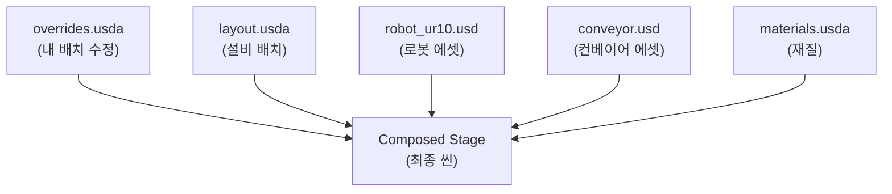
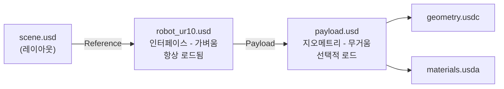
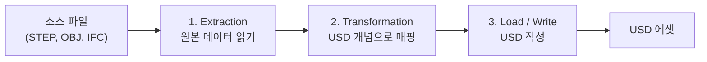

<callout icon="🧭" color="blue_bg">
	**이 문서는** NVIDIA 공식 학습 사이트 *Learn OpenUSD* 의 커리큘럼을 **디지털 트윈 업무를 처음 시작하는 사람** 기준으로 재구성한 요약·해설서입니다.
	원문은 영어이고 예제가 흩어져 있어서, 여기서는 **"왜 필요한가 → 개념 → 코드 → 디지털 트윈에서는 이렇게 쓴다"** 순서로 다시 배열했습니다.
	원문: https://docs.nvidia.com/learn-openusd/latest/index.html
</callout>

<table_of_contents/>

---

# 0. 시작하기 전에

## 0-1. 이 문서를 읽으면 무엇을 할 수 있게 되나

읽고 나면 다음을 **혼자서** 할 수 있게 되는 것이 목표입니다.

- 공장·설비 3D 데이터를 USD로 정리해서 **다른 팀과 동시에 작업**할 수 있는 구조로 만들기
- CAD/스캔 데이터를 USD로 **변환**하고, 무엇이 깨지는지 예측하기
- 수만 개 반복 객체(볼트, 파이프, 팔레트, 랙)를 **성능 붕괴 없이** 배치하기
- 씬이 이상하게 보일 때 **어느 레이어의 어떤 의견(opinion)이 이겼는지** 추적하기
- 시뮬레이션(로봇, 물류, 물리)에 넘길 수 있는 **깨끗한 에셋 구조** 설계하기

## 0-2. 사전 지식은 어디까지 필요한가

<table fit-page-width="true" header-row="true">
	<tr>
		<td>항목</td>
		<td>필요 수준</td>
		<td>비고</td>
	</tr>
	<tr>
		<td>3D 기본 용어 (메시, 트랜스폼, 머티리얼)</td>
		<td>들어는 봤다 수준</td>
		<td>본문에서 다시 설명함</td>
	</tr>
	<tr>
		<td>Python</td>
		<td>for문, 함수 읽을 수 있으면 충분</td>
		<td>OpenUSD 실무의 90%는 Python</td>
	</tr>
	<tr>
		<td>C++</td>
		<td>불필요</td>
		<td>플러그인 직접 만들 때만</td>
	</tr>
	<tr>
		<td>Omniverse / Isaac Sim</td>
		<td>불필요</td>
		<td>USD를 먼저 배우는 게 순서상 맞음</td>
	</tr>
</table>

## 0-3. 원문 커리큘럼 지도

*Learn OpenUSD* 는 크게 **Foundations(기초)** 와 **Applied Concepts(응용)** 로 나뉩니다.

<table fit-page-width="true" header-row="true">
	<tr>
		<td>원문 모듈</td>
		<td>난이도</td>
		<td>핵심 질문</td>
		<td>이 문서</td>
	</tr>
	<tr>
		<td>What Is OpenUSD?</td>
		<td>기초</td>
		<td>USD가 대체 뭔가?</td>
		<td>1장</td>
	</tr>
	<tr>
		<td>Setting the Stage</td>
		<td>기초</td>
		<td>Stage / Prim / Attribute란?</td>
		<td>3장</td>
	</tr>
	<tr>
		<td>Scene Description Blueprints (Schemas)</td>
		<td>기초</td>
		<td>Prim의 타입은 어떻게 정해지나?</td>
		<td>4장</td>
	</tr>
	<tr>
		<td>Beyond the Basics</td>
		<td>중급</td>
		<td>Kind, 순회, 단위, 값 결정</td>
		<td>5장</td>
	</tr>
	<tr>
		<td>Composition Basics</td>
		<td>중급</td>
		<td>레이어는 어떻게 합쳐지나?</td>
		<td>6장</td>
	</tr>
	<tr>
		<td>Creating Composition Arcs</td>
		<td>중급~고급</td>
		<td>LIVERPS 7가지 아크 실전</td>
		<td>7장</td>
	</tr>
	<tr>
		<td>Asset Structure Principles</td>
		<td>고급</td>
		<td>확장 가능한 에셋 구조 설계</td>
		<td>8장</td>
	</tr>
	<tr>
		<td>Asset Modularity and Instancing</td>
		<td>고급</td>
		<td>수십만 개를 어떻게 감당하나?</td>
		<td>9장</td>
	</tr>
	<tr>
		<td>Data Exchange</td>
		<td>고급</td>
		<td>CAD를 어떻게 USD로?</td>
		<td>10장</td>
	</tr>
</table>

<callout icon="🎯" color="green_bg">
	원문 커리큘럼은 **OpenUSD Development Certification** 시험 대비까지 염두에 두고 설계되어 있습니다. 자격증이 목표라면 6~9장을 특히 꼼꼼히 보세요.
</callout>

---

# 1. 디지털 트윈과 OpenUSD

## 1-1. 디지털 트윈 프로젝트가 실제로 망가지는 지점

디지털 트윈을 처음 하면 보통 이렇게 시작합니다.

1. 설비 업체에서 STEP/IGES CAD 파일을 받는다
2. 건물 도면과 레이저 스캔 포인트 클라우드를 받는다
3. 3D 툴에서 예쁘게 배치한다
4. **그 다음 주에 설비 배치가 바뀐다**
5. 동시에 조명팀은 조명을, 물리팀은 충돌체를, 시뮬레이션팀은 로봇 경로를 건드리고 있다
6. 파일을 서로 덮어쓰고, 누가 뭘 바꿨는지 아무도 모른다

전통적인 단일 파일 포맷(FBX, OBJ, glTF)은 3번까지는 잘합니다. **4~6번에서 무너집니다.**

OpenUSD는 정확히 이 지점을 해결하려고 만들어졌습니다. Pixar가 수백 명이 한 장면을 동시에 만들기 위해 개발했고, 그 구조가 그대로 공장 디지털 트윈에 들어맞습니다.

## 1-2. OpenUSD는 "파일 포맷"이 아니다

가장 먼저 버려야 할 오해입니다.

<table fit-page-width="true" header-row="true">
	<tr>
		<td>오해</td>
		<td>사실</td>
	</tr>
	<tr>
		<td>USD는 FBX 같은 파일 포맷이다</td>
		<td>USD는 **씬을 조립하는 프레임워크**이고, 파일 포맷은 그중 일부다</td>
	</tr>
	<tr>
		<td>USD 파일 하나에 씬 전체가 들어있다</td>
		<td>보통 수십~수천 개 파일이 **참조 그래프**로 엮여 하나의 씬이 된다</td>
	</tr>
	<tr>
		<td>USD는 NVIDIA 기술이다</td>
		<td>Pixar가 만들고 오픈소스로 공개, 현재 **AOUSD**(Alliance for OpenUSD)가 표준화 중. NVIDIA는 주요 기여자</td>
	</tr>
	<tr>
		<td>USD는 렌더링용이다</td>
		<td>지오메트리, 물리, 재질, 애니메이션, 센서, 커스텀 데이터까지 담는 **범용 3D 데이터 모델**</td>
	</tr>
</table>

## 1-3. 세 문장 요약

<callout icon="💡" color="yellow_bg">
	**1.** USD는 여러 파일(레이어)의 **의견(opinion)** 을 정해진 우선순위로 합쳐서 하나의 씬을 만든다.
	**2.** 원본을 절대 고치지 않고 **위에 덮어쓰는(override)** 방식이라, 여러 팀이 동시에 작업해도 충돌이 나지 않는다.
	**3.** 무거운 데이터는 필요할 때만 불러오게(payload) 만들 수 있어서, 공장 전체 같은 거대한 씬도 열린다.
</callout>

## 1-4. 디지털 트윈 요구사항과 OpenUSD 기능 대응

<table fit-page-width="true" header-row="true">
	<tr>
		<td>디지털 트윈 요구사항</td>
		<td>대응하는 OpenUSD 기능</td>
		<td>본문 위치</td>
	</tr>
	<tr>
		<td>여러 소스(CAD, 스캔, BIM)의 데이터 통합</td>
		<td>Reference, Sublayer, File Format Plugin</td>
		<td>7장, 10장</td>
	</tr>
	<tr>
		<td>여러 팀 동시 작업 / 비파괴 편집</td>
		<td>Layer Stack, override, Specifier `over`</td>
		<td>6장, 8장</td>
	</tr>
	<tr>
		<td>공장 전체 규모 씬 열기</td>
		<td>Payload, Instancing, usdc 바이너리</td>
		<td>7장, 9장</td>
	</tr>
	<tr>
		<td>레이아웃 대안 비교 (A안 vs B안)</td>
		<td>VariantSet</td>
		<td>7장</td>
	</tr>
	<tr>
		<td>설비 카탈로그 재사용</td>
		<td>Asset Interface, Model Kind, Component</td>
		<td>8장</td>
	</tr>
	<tr>
		<td>시뮬레이션 연동 (로봇, 물류, 물리)</td>
		<td>UsdPhysics 스키마, 커스텀 스키마</td>
		<td>4장</td>
	</tr>
	<tr>
		<td>시간에 따른 상태 변화 기록</td>
		<td>TimeCode / TimeSample</td>
		<td>3장</td>
	</tr>
</table>

---

# 2. 환경 준비 — 10분 만에 첫 USD 만들기

## 2-1. 설치

가장 가벼운 방법은 Python 패키지입니다. Omniverse를 깔 필요 없습니다.

```bash
python -m venv usdenv
source usdenv/bin/activate        # Windows: usdenv\Scripts\activate
pip install usd-core
```

시각적으로 확인하려면 `usdview` 가 포함된 배포판(Omniverse Kit, NVIDIA USD 빌드 등)을 추가로 설치하면 좋지만, 처음에는 텍스트로 확인하는 게 오히려 학습에 좋습니다.

## 2-2. 첫 코드 — Hello Stage

```python
from pxr import Usd, UsdGeom

# 1) 무대(Stage)를 만든다
stage = Usd.Stage.CreateNew("hello.usda")

# 2) 무대 위에 프림(Prim)을 하나 정의한다
xform = UsdGeom.Xform.Define(stage, "/World")
cube  = UsdGeom.Cube.Define(stage, "/World/Box")

# 3) 속성(Attribute) 값을 준다
cube.GetSizeAttr().Set(2.0)

# 4) 기본 프림 지정 (다른 파일이 이 파일을 참조할 때의 진입점)
stage.SetDefaultPrim(xform.GetPrim())

# 5) 저장
stage.GetRootLayer().Save()
```

만들어진 `hello.usda` 를 텍스트 에디터로 열어보세요. **이게 USD 학습의 핵심 습관입니다.**

```
#usda 1.0
(
    defaultPrim = "World"
)

def Xform "World"
{
    def Cube "Box"
    {
        double size = 2
    }
}
```

<callout icon="✅" color="green_bg">
	**습관 1:** 뭔가 이해가 안 되면 `.usda` 로 저장해서 텍스트로 열어본다. USD는 사람이 읽을 수 있게 설계되어 있습니다.
</callout>

---

# 3. Part 1 — 무대 세팅 (Setting the Stage)

원문 모듈: *Setting the Stage*. 여기서 나오는 6개 단어(Stage, Layer, Prim, Property, Path, Schema)를 정확히 구분하면 나머지는 훨씬 쉬워집니다.

## 3-1. Stage — 무대

**Stage는 파일이 아닙니다.** 여러 데이터 소스(레이어)를 합성해서 메모리에 만들어진 **하나의 통합된 씬그래프**입니다.

극장에 비유하면:

- **Layer** = 대본, 조명 큐시트, 음향 큐시트 (각각 별도 문서)
- **Stage** = 그 문서들을 다 합쳐서 실제로 올려진 공연

```python
stage = Usd.Stage.Open("factory.usd")      # 열기 (합성이 일어남)
stage = Usd.Stage.CreateInMemory()          # 디스크 없이 임시로
stage = Usd.Stage.CreateNew("new.usda")     # 새로 만들기

print(stage.GetRootLayer().identifier)      # 루트 레이어 경로
print(stage.GetPseudoRoot())                # 최상위 가상 루트 "/"
```

## 3-2. Layer — 레이어

레이어는 **실제 씬 데이터가 저장되는 컨테이너**이자, 보통 디스크의 한 파일입니다. 레이어 안에는 "이 프림의 이 속성은 이 값이다"라는 **의견(opinion)** 들이 들어있습니다.

디지털 트윈에서 레이어를 나누는 전형적인 방식:

```
factory.usd                (루트 - 아무것도 안 들어있고 조립만 함)
 ├─ layout.usd             (설비 배치 - 레이아웃팀)
 ├─ materials.usd          (재질 - 비주얼팀)
 ├─ physics.usd            (충돌체, 질량 - 시뮬레이션팀)
 ├─ lighting.usd           (조명 - 비주얼팀)
 └─ annotations.usd        (센서 위치, 라벨 - 데이터팀)
```

각 팀이 **자기 파일만** 건드리므로 머지 충돌이 원천적으로 없습니다.

## 3-3. Prim — 프림

Prim(Primitive)은 씬그래프의 **노드**이자 USD의 기본 building block입니다. 폴더처럼 계층을 이루고, 안에 속성과 관계를 담습니다.

```python
prim = stage.GetPrimAtPath("/World/Box")

prim.GetName()          # "Box"
prim.GetPath()          # Sdf.Path("/World/Box")
prim.GetTypeName()      # "Cube"
prim.GetParent()        # /World 프림
prim.GetChildren()      # 자식 프림 리스트
prim.IsValid()          # 유효한가
prim.IsActive()         # 활성 상태인가 (False면 씬에서 사라짐)
```

<callout icon="⚠️" color="orange_bg">
	`GetPrimAtPath` 가 없는 경로를 반환해도 **에러가 나지 않고 invalid prim** 을 돌려줍니다. 항상 `if prim:` 으로 확인하세요. 초보자가 가장 많이 당하는 함정입니다.
</callout>

### Specifier — def / over / class

프림 앞에 붙는 키워드로, **"이 프림을 어떤 자격으로 선언하는가"** 를 뜻합니다. 합성(composition)을 이해하는 데 결정적입니다.

<table fit-page-width="true" header-row="true">
	<tr>
		<td>Specifier</td>
		<td>의미</td>
		<td>언제 쓰나</td>
	</tr>
	<tr>
		<td>`def`</td>
		<td>define. 이 프림이 **실제로 존재한다**고 선언</td>
		<td>새 객체를 만들 때 (기본)</td>
	</tr>
	<tr>
		<td>`over`</td>
		<td>override. 존재를 주장하지 않고 **기존 프림에 의견만 얹음**. 가장 약함</td>
		<td>다른 팀 에셋을 안 건드리고 값만 바꿀 때</td>
	</tr>
	<tr>
		<td>`class`</td>
		<td>추상 청사진. 자체로는 씬에 안 나타나고 **다른 프림이 상속**해서 씀</td>
		<td>공통 속성 템플릿 (inherits와 짝)</td>
	</tr>
</table>

```
# override 레이어의 전형적인 모습 — 원본을 전혀 수정하지 않는다
over "World"
{
    over "Robot_01"
    {
        double3 xformOp:translate = (12.5, 0, 3.2)
    }
}
```

<callout icon="💡" color="yellow_bg">
	**디지털 트윈 실무 팁:** 남이 만든 설비 에셋의 위치를 옮길 때는 원본 파일을 절대 열지 말고, 내 레이어에 `over` 로 위치만 덮어쓰세요. 나중에 설비 업체가 모델을 업데이트해도 내 배치는 그대로 살아있습니다.
</callout>

## 3-4. Property — 속성 (Attribute와 Relationship)

Prim이 담는 데이터는 두 종류입니다.

### Attribute — 값

이름 + 데이터 타입 + 값. 시간에 따라 변할 수도 있습니다.

```python
from pxr import Usd, UsdGeom, Gf, Sdf

prim = stage.GetPrimAtPath("/World/Box")

# 기존 속성 읽기
size = UsdGeom.Cube(prim).GetSizeAttr().Get()

# 새 속성 만들기
attr = prim.CreateAttribute("temperature", Sdf.ValueTypeNames.Float)
attr.Set(23.5)

# 시간에 따라 변하는 값
attr.Set(23.5, Usd.TimeCode(1))
attr.Set(87.2, Usd.TimeCode(120))
```

자주 쓰는 타입: `Bool` `Int` `Float` `Double` `String` `Token` `Float3` `Double3` `Matrix4d` `Point3fArray` `Color3f` `Asset`

### Relationship — 연결

다른 프림/속성을 **가리키는 포인터**입니다. 값이 아니라 경로를 담습니다.

```python
rel = prim.CreateRelationship("controlledBy")
rel.SetTargets(["/World/PLC/Controller_A"])
```

디지털 트윈에서의 활용: 설비 → 담당 PLC, 컨베이어 → 다음 공정, 센서 → 감시 대상 등 **논리적 연결**을 3D 안에 직접 기록할 수 있습니다. 머티리얼 바인딩도 내부적으로 Relationship입니다.

## 3-5. Path — 경로

프림과 속성을 가리키는 주소입니다. 파일 경로와 비슷하게 생겼습니다.

```
/World/Factory/Line_A/Robot_01              ← 프림 경로
/World/Factory/Line_A/Robot_01.temperature  ← 속성 경로 (점으로 구분)
/World/Factory/Line_A/Robot_01.proxyPrim    ← 관계 경로
```

```python
from pxr import Sdf
p = Sdf.Path("/World/Factory/Robot_01")
p.GetParentPath()        # /World/Factory
p.AppendChild("Arm")     # /World/Factory/Robot_01/Arm
p.IsPrimPath()           # True
```

<callout icon="⚠️" color="orange_bg">
	프림 이름에는 **영문/숫자/언더스코어만** 쓸 수 있습니다. 공백, 하이픈, 한글, 점은 불가. CAD에서 가져온 이름이 `모터-01 (주)` 같은 형태면 변환 단계에서 반드시 정규화해야 합니다. 원본 이름은 `displayName` 메타데이터에 보관하세요.
</callout>

## 3-6. 파일 포맷 — usda / usdc / usd / usdz

<table fit-page-width="true" header-row="true">
	<tr>
		<td>확장자</td>
		<td>형태</td>
		<td>특징</td>
		<td>언제 쓰나</td>
	</tr>
	<tr>
		<td>`.usda`</td>
		<td>ASCII 텍스트</td>
		<td>사람이 읽고 diff 가능, 용량 큼</td>
		<td>레이아웃, 오버라이드, 학습, 코드리뷰</td>
	</tr>
	<tr>
		<td>`.usdc`</td>
		<td>바이너리 (Crate)</td>
		<td>빠르고 작음, lazy 로딩 유리</td>
		<td>메시 등 대용량 지오메트리</td>
	</tr>
	<tr>
		<td>`.usd`</td>
		<td>둘 중 아무거나</td>
		<td>내용으로 자동 판별. 나중에 포맷 바꿔도 참조 안 깨짐</td>
		<td>범용 (많이 씀)</td>
	</tr>
	<tr>
		<td>`.usdz`</td>
		<td>무압축 zip 패키지</td>
		<td>텍스처까지 한 덩어리, **읽기 전용**</td>
		<td>배포, AR, 외부 전달</td>
	</tr>
</table>

<callout icon="💡" color="yellow_bg">
	**실무 조합:** 사람이 자주 손대는 레이어(배치, 오버라이드)는 `.usda`, 무거운 메시는 `.usdc`. 이렇게 하면 Git diff도 읽히고 로딩도 빠릅니다.
</callout>

## 3-7. USD Python 모듈 지도

처음에는 `from pxr import ???` 에서 뭘 넣어야 할지 몰라 헤맵니다. 지도부터 외우세요.

<table fit-page-width="true" header-row="true">
	<tr>
		<td>모듈</td>
		<td>역할</td>
		<td>대표 클래스</td>
	</tr>
	<tr>
		<td>`Usd`</td>
		<td>핵심 API — 스테이지, 프림, 속성, 합성</td>
		<td>`Usd.Stage` `Usd.Prim` `Usd.Attribute` `Usd.TimeCode`</td>
	</tr>
	<tr>
		<td>`Sdf`</td>
		<td>저수준 씬 기술 — 레이어, 경로, 타입</td>
		<td>`Sdf.Layer` `Sdf.Path` `Sdf.ValueTypeNames`</td>
	</tr>
	<tr>
		<td>`UsdGeom`</td>
		<td>지오메트리 스키마</td>
		<td>`UsdGeom.Xform` `Mesh` `Cube` `Camera` `PointInstancer`</td>
	</tr>
	<tr>
		<td>`UsdShade`</td>
		<td>머티리얼/셰이더</td>
		<td>`UsdShade.Material` `UsdShade.Shader`</td>
	</tr>
	<tr>
		<td>`UsdPhysics`</td>
		<td>물리 (강체, 조인트, 충돌)</td>
		<td>`UsdPhysics.RigidBodyAPI` `CollisionAPI`</td>
	</tr>
	<tr>
		<td>`UsdLux`</td>
		<td>조명</td>
		<td>`UsdLux.DistantLight` `DomeLight`</td>
	</tr>
	<tr>
		<td>`Gf`</td>
		<td>수학 (벡터, 행렬, 사원수)</td>
		<td>`Gf.Vec3f` `Gf.Matrix4d` `Gf.Quatf`</td>
	</tr>
	<tr>
		<td>`Vt`</td>
		<td>배열 타입</td>
		<td>`Vt.Vec3fArray` `Vt.IntArray`</td>
	</tr>
	<tr>
		<td>`Kind`</td>
		<td>모델 종류 레지스트리</td>
		<td>`Kind.Tokens.component`</td>
	</tr>
	<tr>
		<td>`Ar`</td>
		<td>에셋 경로 해석</td>
		<td>`Ar.GetResolver()`</td>
	</tr>
	<tr>
		<td>`Tf`</td>
		<td>기반 유틸 (디버그, 타입, 에러)</td>
		<td>`Tf.Debug`</td>
	</tr>
</table>

## 3-8. TimeCode와 TimeSample — 시간 다루기

디지털 트윈에서 "시간"은 애니메이션만이 아니라 **설비 상태 이력, 센서 값, 시뮬레이션 결과**를 담는 축입니다.

- **TimeCode**: 단위 없는 시간 좌표. 흔히 "프레임"이라고 생각하면 됩니다. 실제 초 단위 의미는 스테이지의 `timeCodesPerSecond` 가 결정합니다.
- **TimeSample**: 특정 TimeCode에 대응하는 **속성의 실제 값**. 하나의 속성이 여러 TimeSample을 가질 수 있습니다.

```python
stage.SetStartTimeCode(0)
stage.SetEndTimeCode(240)
stage.SetTimeCodesPerSecond(24)     # 240 timecode = 10초

attr = prim.GetAttribute("xformOp:translate")
attr.Set(Gf.Vec3d(0, 0, 0),   Usd.TimeCode(0))
attr.Set(Gf.Vec3d(10, 0, 0),  Usd.TimeCode(240))

# 읽기
attr.Get(Usd.TimeCode(120))     # 중간값은 선형 보간됨
attr.Get()                      # Default 값 (시간 무관)
```

<callout icon="⚠️" color="orange_bg">
	**Default 값과 TimeSample은 별개입니다.** TimeSample이 하나라도 있으면 Default는 무시됩니다. "값을 넣었는데 안 보인다"의 흔한 원인입니다.
</callout>

---

# 4. Part 2 — 스키마 (Scene Description Blueprints)

## 4-1. 스키마란

Prim은 그 자체로는 그냥 빈 컨테이너입니다. **스키마가 "이건 메시다", "이건 카메라다"라는 의미와 표준 속성 세트를 부여**합니다. 설계도(blueprint)라고 생각하면 됩니다.

## 4-2. IsA 스키마 vs API 스키마

이 둘의 구분은 원문에서도 강조하는 핵심 개념이고, 자격증 시험에도 나옵니다.

<table fit-page-width="true" header-row="true">
	<tr>
		<td>구분</td>
		<td>IsA 스키마 (Typed)</td>
		<td>API 스키마</td>
	</tr>
	<tr>
		<td>답하는 질문</td>
		<td>"이건 **무엇인가**?"</td>
		<td>"이건 **무엇을 할 수 있는가**?"</td>
	</tr>
	<tr>
		<td>typeName</td>
		<td>있음 (프림당 하나만)</td>
		<td>없음 (여러 개 붙일 수 있음)</td>
	</tr>
	<tr>
		<td>예시</td>
		<td>`Mesh` `Xform` `Camera` `Scope` `DistantLight`</td>
		<td>`UsdPhysicsRigidBodyAPI` `UsdPhysicsCollisionAPI` `UsdShadeMaterialBindingAPI`</td>
	</tr>
	<tr>
		<td>비유</td>
		<td>사람의 직업 (하나)</td>
		<td>보유 자격증 (여러 개)</td>
	</tr>
</table>

```python
from pxr import UsdGeom, UsdPhysics

# IsA: 이 프림은 Mesh다
mesh = UsdGeom.Mesh.Define(stage, "/World/Conveyor")

# API: 여기에 "강체 물리" 능력과 "충돌" 능력을 추가로 부여
UsdPhysics.RigidBodyAPI.Apply(mesh.GetPrim())
UsdPhysics.CollisionAPI.Apply(mesh.GetPrim())
```

<callout icon="💡" color="yellow_bg">
	**디지털 트윈에서 특히 중요:** 같은 컨베이어 메시에 물리 API, 시맨틱 라벨 API, 사내 자산관리 API를 **동시에** 붙일 수 있습니다. 새 요구사항이 생겨도 기존 지오메트리를 다시 만들 필요가 없다는 뜻입니다.
</callout>

## 4-3. 자주 쓰는 스키마

<table fit-page-width="true" header-row="true">
	<tr>
		<td>스키마</td>
		<td>용도</td>
		<td>디지털 트윈 사용 예</td>
	</tr>
	<tr>
		<td>`Xform`</td>
		<td>변환(위치/회전/스케일)을 갖는 그룹</td>
		<td>모든 설비의 루트</td>
	</tr>
	<tr>
		<td>`Scope`</td>
		<td>변환 없는 순수 그룹 (폴더)</td>
		<td>`/World/Looks`, `/World/Sensors`</td>
	</tr>
	<tr>
		<td>`Mesh`</td>
		<td>폴리곤 메시</td>
		<td>설비 형상</td>
	</tr>
	<tr>
		<td>`Cube` `Cylinder` `Sphere` `Capsule`</td>
		<td>기본 도형</td>
		<td>충돌체 프록시, 볼륨 표시</td>
	</tr>
	<tr>
		<td>`PointInstancer`</td>
		<td>대량 인스턴싱</td>
		<td>볼트, 팔레트, 랙, 재고 박스</td>
	</tr>
	<tr>
		<td>`Camera`</td>
		<td>카메라</td>
		<td>가상 CCTV, 비전 검사 카메라</td>
	</tr>
	<tr>
		<td>`Material` `Shader`</td>
		<td>재질</td>
		<td>MDL/UsdPreviewSurface 재질</td>
	</tr>
	<tr>
		<td>`UsdPhysics` 계열</td>
		<td>물리</td>
		<td>로봇 조인트, 충돌, 질량</td>
	</tr>
</table>

## 4-4. 커스텀 스키마는 언제 만드나

사내 고유 데이터(설비코드, 정비주기, MES 연동키)를 담고 싶을 때 선택지는 세 가지입니다.

1. **커스텀 속성** — 가장 쉬움. 그냥 `CreateAttribute` 로 아무 이름이나 추가. 소규모/실험용.
2. **커스텀 API 스키마** — 중간. 스키마 정의 파일(`schema.usda`)로 표준화. 팀 단위 표준화에 적합.
3. **커스텀 IsA 스키마** — 무거움. 정말 새로운 종류의 객체일 때만.

<callout icon="✅" color="green_bg">
	**추천 경로:** 커스텀 속성으로 시작 → 팀에서 반복적으로 쓰이면 API 스키마로 승격. 처음부터 IsA 스키마를 만들지 마세요.
</callout>

---

# 5. Part 3 — Beyond the Basics

원문 모듈: *Beyond the Basics*. 기초와 합성(composition) 사이의 다리 역할을 하는 개념들입니다.

## 5-1. Model Kinds — 계층에 의미 부여하기

씬그래프는 그냥 트리라서, 어디까지가 "하나의 완결된 에셋"인지 기계가 알 수 없습니다. **Kind는 프림에 붙이는 메타데이터로, 그 프림이 모델 계층에서 어떤 역할인지 표시**합니다. 스키마 타입과는 **완전히 별개**입니다.

<table fit-page-width="true" header-row="true">
	<tr>
		<td>Kind</td>
		<td>의미</td>
		<td>공장 예시</td>
	</tr>
	<tr>
		<td>`group`</td>
		<td>다른 모델들을 묶는 조직 단위</td>
		<td>`/World/Factory`, `/World/Factory/Line_A`</td>
	</tr>
	<tr>
		<td>`assembly`</td>
		<td>group의 하위 종류. 여러 파트를 모아 만든 **published 조합물**</td>
		<td>`/World/Factory/Line_A/Cell_03` (로봇+지그+펜스)</td>
	</tr>
	<tr>
		<td>`component`</td>
		<td>**재사용 가능하고 완결된 leaf 에셋**. 카탈로그의 한 품목</td>
		<td>`Robot_UR10`, `Conveyor_2m`</td>
	</tr>
	<tr>
		<td>`subcomponent`</td>
		<td>component 내부의 의미 있는 부분</td>
		<td>로봇의 `Joint_3`, 컨베이어의 `Motor`</td>
	</tr>
</table>

```python
from pxr import Usd, Kind

Usd.ModelAPI(prim).SetKind(Kind.Tokens.component)

# 조회
Usd.ModelAPI(prim).GetKind()
prim.IsModel()          # group/assembly/component 계열인가
prim.IsGroup()
```

### 모델 계층의 규칙 (반드시 지킬 것)

<callout icon="⚠️" color="red_bg">
	**1.** `component` 아래에는 다른 `component` 나 `group` 이 올 수 없습니다. component는 **leaf 모델**입니다. 내부 구조는 `subcomponent` 로 표시합니다.
	**2.** 모델 계층은 루트부터 **끊기지 않아야** 합니다. component의 모든 조상은 group 또는 assembly여야 합니다.
	**3.** 이 규칙이 깨지면 뷰어의 선택 동작, 인스턴싱 최적화, 카탈로그 검색이 다 이상해집니다.
</callout>

**왜 중요한가:** Kind가 제대로 붙어 있으면 "이 공장에 있는 모든 로봇을 찾아라", "설비 단위로만 선택하게 하라", "component 단위로 payload를 언로드하라" 같은 작업이 한 줄이 됩니다.

## 5-2. Stage Traversal — 씬그래프 순회

```python
# 전체 순회 (깊이 우선, 활성/로드/정의된/비추상 프림만)
for prim in stage.Traverse():
    print(prim.GetPath(), prim.GetTypeName())

# 타입으로 필터
for prim in stage.Traverse():
    if prim.IsA(UsdGeom.Mesh):
        ...

# Kind로 필터 — 디지털 트윈에서 자주 씀
for prim in stage.Traverse():
    if Usd.ModelAPI(prim).GetKind() == Kind.Tokens.component:
        print("설비:", prim.GetPath())
```

### 성능: PruneChildren

component 안까지 다 들어갈 필요가 없다면 가지를 잘라내세요. 수백만 프림 씬에서 차이가 큽니다.

```python
it = iter(Usd.PrimRange(stage.GetPseudoRoot()))
for prim in it:
    if Usd.ModelAPI(prim).GetKind() == Kind.Tokens.component:
        process(prim)
        it.PruneChildren()      # 이 프림의 자식은 건너뛴다
```

### 로드되지 않은 것까지 보려면

```python
# 비활성/미정의/추상 프림까지 모두
for prim in stage.TraverseAll():
    ...
```

## 5-3. Composition vs Value Resolution — 헷갈리는 한 쌍

원문에서도 따로 한 장을 할애하는 구분입니다.

<table fit-page-width="true" header-row="true">
	<tr>
		<td></td>
		<td>Composition (합성)</td>
		<td>Value Resolution (값 결정)</td>
	</tr>
	<tr>
		<td>하는 일</td>
		<td>**데이터가 어디에 있는지** 목록(인덱스)을 만든다</td>
		<td>그 목록을 따라가서 **실제 값 하나**를 고른다</td>
	</tr>
	<tr>
		<td>언제</td>
		<td>스테이지를 열 때 / 아크가 바뀔 때</td>
		<td>속성 값을 요청할 때마다</td>
	</tr>
	<tr>
		<td>결과물</td>
		<td>프림별 인덱스 (PcpPrimIndex)</td>
		<td>속성값 하나</td>
	</tr>
	<tr>
		<td>비유</td>
		<td>도서관 색인 만들기</td>
		<td>색인 보고 책 한 권 꺼내기</td>
	</tr>
</table>

**왜 알아야 하나:** 씬이 느리다면 원인이 둘 중 어디인지에 따라 처방이 완전히 다릅니다. 합성이 느리면 → 아크 구조를 단순화. 값 결정이 느리면 → 조회 코드를 캐싱.

## 5-4. Units — 단위와 좌표계 (디지털 트윈 최대 지뢰)

<callout icon="🚨" color="red_bg">
	**서로 다른 소스에서 온 데이터를 합칠 때 90%의 사고는 단위와 축에서 납니다.** CAD는 mm, 게임엔진은 m, 스캔은 또 다를 수 있습니다.
</callout>

```python
from pxr import UsdGeom

UsdGeom.SetStageMetersPerUnit(stage, 1.0)          # 1 unit = 1 meter
UsdGeom.SetStageUpAxis(stage, UsdGeom.Tokens.z)    # Z-up (제조/건축 관례)

# 확인
UsdGeom.GetStageMetersPerUnit(stage)
UsdGeom.GetStageUpAxis(stage)
```

<table fit-page-width="true" header-row="true">
	<tr>
		<td>메타데이터</td>
		<td>의미</td>
		<td>권장값 (제조 디지털 트윈)</td>
	</tr>
	<tr>
		<td>`metersPerUnit`</td>
		<td>1 유닛이 몇 미터인가</td>
		<td>`1.0` (미터)</td>
	</tr>
	<tr>
		<td>`upAxis`</td>
		<td>어느 축이 위인가</td>
		<td>`Z` (CAD/BIM 관례)</td>
	</tr>
	<tr>
		<td>`kilogramsPerUnit`</td>
		<td>1 질량 유닛이 몇 kg인가</td>
		<td>`1.0` (kg)</td>
	</tr>
</table>

<callout icon="✅" color="green_bg">
	**습관 2:** 프로젝트 시작 시 팀 표준으로 `metersPerUnit` 과 `upAxis` 를 문서에 못 박고, 변환 스크립트에 **검증 단계**를 넣으세요. 나중에 고치는 비용이 100배입니다.
</callout>

## 5-5. Primvars — 지오메트리에 붙는 특수 속성

Primvar는 **버텍스/페이스 단위로 보간될 수 있고, 자식 프림으로 상속되는 특수 속성**입니다. 주로 셰이딩에 쓰입니다.

```python
from pxr import UsdGeom, Vt

pv_api = UsdGeom.PrimvarsAPI(mesh.GetPrim())
pv = pv_api.CreatePrimvar("displayColor",
                          Sdf.ValueTypeNames.Color3fArray,
                          UsdGeom.Tokens.constant)
pv.Set(Vt.Vec3fArray([(0.8, 0.1, 0.1)]))
```

보간 방식(interpolation): `constant`(전체 하나) / `uniform`(면마다) / `varying` / `vertex`(정점마다) / `faceVarying`(면-정점마다)

디지털 트윈 활용: 온도 히트맵, 마모도, 검사 결과 등을 메시 표면에 색으로 입힐 때.

## 5-6. Custom Properties — 사내 데이터 붙이기

```python
attr = prim.CreateAttribute("acme:equipmentId", Sdf.ValueTypeNames.String)
attr.Set("EQ-2024-0871")

prim.CreateAttribute("acme:maintenanceCycleDays", Sdf.ValueTypeNames.Int).Set(90)
prim.CreateAttribute("acme:mesTag", Sdf.ValueTypeNames.String).Set("LINE_A/ROBOT/01")
```

<callout icon="✅" color="green_bg">
	**네임스페이스를 반드시 쓰세요.** `acme:` 처럼 접두어를 붙이면 나중에 표준 스키마와 이름 충돌이 없고, `prim.GetPropertiesInNamespace("acme")` 로 한 번에 뽑을 수 있습니다.
</callout>

---

# 6. Part 4 — Composition 기초

여기서부터가 OpenUSD의 진짜 심장입니다. **이 장을 이해하면 USD를 이해한 것입니다.**

## 6-1. Composition이란

여러 레이어에 흩어진 의견(opinion)들을 **정해진 규칙으로 합쳐서 하나의 씬그래프를 만드는 과정**입니다.



같은 속성에 대해 여러 레이어가 서로 다른 의견을 내면, **강도 순서(strength ordering)** 에 따라 강한 쪽이 이깁니다. 약한 의견은 사라지는 게 아니라 **가려질 뿐**이라서, 강한 레이어를 제거하면 다시 드러납니다. 이것이 **비파괴 편집**의 원리입니다.

## 6-2. LIVERPS — 강도 순서

합성 아크(composition arc)의 우선순위를 외우는 약어입니다. **왼쪽이 강하고 오른쪽이 약합니다.**

<table fit-page-width="true" header-row="true">
	<tr>
		<td>순위</td>
		<td>글자</td>
		<td>아크</td>
		<td>한 줄 설명</td>
	</tr>
	<tr>
		<td>1 (최강)</td>
		<td>**L**</td>
		<td>Local (sublayers)</td>
		<td>현재 레이어와 그 서브레이어의 직접 의견</td>
	</tr>
	<tr>
		<td>2</td>
		<td>**I**</td>
		<td>Inherits</td>
		<td>class 프림으로부터의 상속</td>
	</tr>
	<tr>
		<td>3</td>
		<td>**V**</td>
		<td>VariantSets</td>
		<td>선택된 배리언트의 내용</td>
	</tr>
	<tr>
		<td>4</td>
		<td>**E**</td>
		<td>rElocates</td>
		<td>참조된 계층 내 프림의 재배치 (비교적 최신 아크)</td>
	</tr>
	<tr>
		<td>5</td>
		<td>**R**</td>
		<td>References</td>
		<td>다른 에셋 가져오기</td>
	</tr>
	<tr>
		<td>6</td>
		<td>**P**</td>
		<td>Payloads</td>
		<td>지연 로딩되는 참조</td>
	</tr>
	<tr>
		<td>7 (최약)</td>
		<td>**S**</td>
		<td>Specializes</td>
		<td>항상 가장 약하게 남는 기본값 제공</td>
	</tr>
</table>

<callout icon="📌" color="purple_bg">
	**용어 주의:** 예전에는 `relocates` 가 없어서 **LIVRPS**("리버 피스"로 읽음)였습니다. 지금은 **LIVERPS**. 두 표기가 혼용되니 같은 개념이라고 생각하면 됩니다.
</callout>

### 추가 규칙 두 가지

1. **직접(direct) 아크가 조상(ancestral) 아크보다 강하다.** 같은 카테고리 안에서는 내가 직접 건 아크가, 부모로부터 물려받은 아크보다 셉니다.
2. **같은 종류 안에서는 먼저 선언된 것이 강하다.** 서브레이어 리스트, 참조 리스트 모두 **위에 있는 것이 더 강합니다.** (파일 순서가 곧 우선순위)

### 왜 이 순서인가 — 직관

- **Local이 가장 강한 이유:** "지금 내가 여기서 쓴 것"이 항상 이겨야 편집이 예측 가능합니다.
- **Reference가 Local보다 약한 이유:** 남의 에셋을 가져다 쓰되, **내가 위에서 덮어쓸 수 있어야** 하기 때문입니다. 이게 없으면 비파괴 워크플로가 불가능합니다.
- **Specializes가 가장 약한 이유:** "아무도 값을 안 정하면 이걸 써라"는 **폴백(fallback)** 역할이기 때문입니다.

---

# 7. Part 5 — Composition Arc 실전

원문 모듈: *Creating Composition Arcs*. 7가지 아크를 하나씩, **언제 쓰는지** 중심으로 봅니다.

## 7-1. Sublayer — 레이어 쌓기

**같은 씬을 여러 팀이 나눠서 작업할 때** 쓰는 가장 기본적인 아크입니다. 여러 레이어를 순서대로 쌓아 하나의 **레이어 스택**을 만듭니다.

```python
root = stage.GetRootLayer()
root.subLayerPaths = [
    "./overrides.usda",   # 가장 강함 (맨 위)
    "./physics.usda",
    "./materials.usda",
    "./layout.usda",      # 가장 약함 (맨 아래)
]
```

```
#usda 1.0
(
    subLayers = [
        @./overrides.usda@,
        @./physics.usda@,
        @./materials.usda@,
        @./layout.usda@
    ]
)
```

<table fit-page-width="true" header-row="true">
	<tr>
		<td>특징</td>
		<td>내용</td>
	</tr>
	<tr>
		<td>네임스페이스</td>
		<td>**병합됨.** 같은 경로의 프림은 하나로 합쳐짐</td>
	</tr>
	<tr>
		<td>순서</td>
		<td>리스트 위쪽이 강함</td>
	</tr>
	<tr>
		<td>주 용도</td>
		<td>워크스트림 분리, 단계별 오버라이드</td>
	</tr>
	<tr>
		<td>주의</td>
		<td>같은 씬의 다른 측면을 나눌 때 쓰는 것. **에셋을 가져올 때는 Reference를 쓰세요**</td>
	</tr>
</table>

<callout icon="⚠️" color="orange_bg">
	**흔한 실수:** 로봇 에셋 파일을 sublayer로 붙이는 것. sublayer는 경로가 그대로 병합되므로, 여러 대를 배치할 수 없고 네임스페이스가 충돌합니다. **에셋 배치는 무조건 Reference.**
</callout>

## 7-2. Reference — 에셋 가져오기

**다른 USD 파일(또는 같은 파일의 다른 프림)의 내용을, 내 씬의 특정 경로 아래로 가져옵니다.** 디지털 트윈에서 가장 많이 쓰는 아크입니다.

```python
robot = stage.DefinePrim("/World/Line_A/Robot_01", "Xform")
robot.GetReferences().AddReference("./assets/robot_ur10.usd")

# 파일 안의 특정 프림만
robot.GetReferences().AddReference("./assets/robots.usd", "/Robots/UR10")

# 같은 파일 안에서 (internal reference)
robot.GetReferences().AddInternalReference("/Prototypes/Robot")
```

```
def Xform "Robot_01" (
    prepend references = @./assets/robot_ur10.usd@
)
{
    double3 xformOp:translate = (10, 0, 0)
}
```

### 핵심 성질

- **참조된 내용은 내 레이어보다 약하다.** 그래서 위에서 위치/재질/이름표를 자유롭게 덮어쓸 수 있습니다.
- **defaultPrim이 중요하다.** 대상 프림을 지정하지 않으면 참조 대상 파일의 `defaultPrim` 이 사용됩니다. 에셋 파일에는 **반드시** defaultPrim을 설정하세요.
- **여러 번 참조 가능.** 같은 로봇 파일을 20번 참조해서 20대를 배치합니다. 원본은 하나입니다.

<callout icon="💡" color="yellow_bg">
	**디지털 트윈 패턴:** 설비 카탈로그(`/assets/`)를 한 번 만들고, 레이아웃 파일에서는 **참조 + 위치값**만 씁니다. 레이아웃 파일이 몇 KB로 유지되고, 설비 모델이 개선되면 전 라인에 자동 반영됩니다.
</callout>

## 7-3. Payload — 무거운 것을 미뤄 로딩하기

Payload는 **"필요할 때만 불러오는 Reference"** 입니다. 문법도 거의 같습니다.

```python
prim.GetPayloads().AddPayload("./assets/robot_ur10_geo.usd")
```

```python
# 스테이지를 열 때 payload를 안 불러오기
stage = Usd.Stage.Open("factory.usd", Usd.Stage.LoadNone)

# 필요한 것만 로드
stage.Load("/World/Line_A")
stage.Unload("/World/Line_B")

# 현재 로드 상태
stage.GetLoadSet()
```

<table fit-page-width="true" header-row="true">
	<tr>
		<td></td>
		<td>Reference</td>
		<td>Payload</td>
	</tr>
	<tr>
		<td>로딩</td>
		<td>항상 즉시</td>
		<td>선택적 (지연 가능)</td>
	</tr>
	<tr>
		<td>강도</td>
		<td>Payload보다 강함</td>
		<td>Reference보다 약함</td>
	</tr>
	<tr>
		<td>용도</td>
		<td>가벼운 구조, 인터페이스</td>
		<td>무거운 지오메트리, 텍스처</td>
	</tr>
</table>

<callout icon="🎯" color="green_bg">
	**공장 전체 씬을 여는 유일한 방법입니다.** 라인 A만 작업할 때 라인 B~F의 지오메트리를 메모리에 올리지 않습니다. 8장의 **Reference/Payload 패턴**에서 이 둘을 조합하는 표준 구조를 다룹니다.
</callout>

## 7-4. VariantSet — 대안 전환

하나의 프림이 **여러 버전을 가지고 그중 하나를 선택**하게 합니다.

```python
vset = prim.GetVariantSets().AddVariantSet("configuration")

vset.AddVariant("with_gripper")
vset.AddVariant("with_welder")

vset.SetVariantSelection("with_gripper")
with vset.GetVariantEditContext():
    stage.DefinePrim(prim.GetPath().AppendChild("Gripper"), "Xform") \
         .GetReferences().AddReference("./assets/gripper.usd")

vset.SetVariantSelection("with_welder")
with vset.GetVariantEditContext():
    stage.DefinePrim(prim.GetPath().AppendChild("Welder"), "Xform") \
         .GetReferences().AddReference("./assets/welder.usd")

vset.SetVariantSelection("with_gripper")   # 최종 선택
```

디지털 트윈 활용 예:

- **LOD**: `lod` 배리언트 세트 → `high` / `medium` / `proxy` / `bbox`
- **설비 옵션**: 그리퍼 종류, 컨베이어 길이
- **레이아웃 대안**: A안 / B안 / C안 비교 검토
- **상태**: `normal` / `maintenance` / `fault`

<callout icon="💡" color="yellow_bg">
	배리언트 선택은 **참조하는 쪽에서 덮어쓸 수 있습니다.** 에셋에 LOD 배리언트를 만들어두면, 씬에서 "멀리 있는 설비는 proxy로" 같은 결정을 씬 레이어에서 내릴 수 있습니다.
</callout>

## 7-5. Inherits — 클래스 상속

`class` 프림에 정의한 의견을 여러 프림이 **동시에** 물려받게 합니다. 핵심은 **"나중에 class를 고치면 상속받은 모두가 즉시 바뀐다"** 는 것입니다.

```python
# 청사진 정의
base = stage.CreateClassPrim("/_class_SafetyEquipment")
base.CreateAttribute("acme:inspectionCycle", Sdf.ValueTypeNames.Int).Set(30)

# 상속
for path in ["/World/Fence_01", "/World/Fence_02", "/World/LightCurtain_01"]:
    stage.GetPrimAtPath(path).GetInherits().AddInherit("/_class_SafetyEquipment")
```

`_class_` 접두어는 관례입니다. `class` 프림은 씬에 렌더링되지 않습니다.

디지털 트윈 활용: "모든 안전설비의 점검주기를 30일에서 14일로" → **class 한 곳만 수정.**

## 7-6. Specializes — 가장 약한 기본값

Inherits와 비슷하지만 **강도가 정반대**입니다. Specializes로 온 의견은 **항상 가장 약하게** 남습니다.

- **Inherits**: "이 규칙은 웬만하면 이겨야 한다" → 정책, 강제 표준
- **Specializes**: "아무도 안 정하면 이걸 써라" → 기본값, 폴백

```python
prim.GetSpecializes().AddSpecialize("/_base_Material_Steel")
```

<callout icon="📌" color="purple_bg">
	처음에는 Specializes를 안 써도 됩니다. **"기본 재질 정의해두고 개별 설비에서 자유롭게 덮어쓰기"** 같은 상황에서 필요해집니다. 자격증 시험에는 나옵니다.
</callout>

## 7-7. Relocates — 참조된 계층 재배치

참조로 가져온 프림의 **이름/위치를 참조하는 쪽에서 바꿉니다.** 원본을 수정하지 않고 네임스페이스를 재구성할 때 씁니다. 비교적 최근에 추가된 아크라 LIVERPS의 E가 되었습니다. 입문 단계에서 직접 쓸 일은 드뭅니다.

## 7-8. 아크 선택 치트시트

<table fit-page-width="true" header-row="true">
	<tr>
		<td>하고 싶은 일</td>
		<td>쓸 아크</td>
	</tr>
	<tr>
		<td>다른 팀과 같은 씬을 나눠 작업</td>
		<td>**Sublayer**</td>
	</tr>
	<tr>
		<td>카탈로그 설비를 씬에 배치</td>
		<td>**Reference**</td>
	</tr>
	<tr>
		<td>무거운 지오메트리를 나중에 로딩</td>
		<td>**Payload**</td>
	</tr>
	<tr>
		<td>A안/B안, LOD, 옵션 전환</td>
		<td>**VariantSet**</td>
	</tr>
	<tr>
		<td>여러 프림에 공통 규칙 강제</td>
		<td>**Inherits**</td>
	</tr>
	<tr>
		<td>덮어쓰기 쉬운 기본값 제공</td>
		<td>**Specializes**</td>
	</tr>
	<tr>
		<td>남의 에셋 값만 살짝 수정</td>
		<td>아크가 아니라 **`over`**</td>
	</tr>
</table>

## 7-9. 디버깅 — "왜 이 값이 나오지?"

합성이 복잡해지면 반드시 겪는 상황입니다. 도구를 미리 알아두세요.

### 1) usdview의 Composition 탭

프림을 선택하면 그 프림의 인덱스가 어떤 아크들로 만들어졌는지 트리로 보여줍니다. **가장 빠른 진단 방법입니다.**

### 2) PrimCompositionQuery

```python
query = Usd.PrimCompositionQuery(prim)
for arc in query.GetCompositionArcs():
    print(arc.GetArcType(),
          arc.GetIntroducingLayer(),
          arc.GetTargetPrimPath())
```

### 3) 속성 값의 출처 추적

```python
attr = prim.GetAttribute("xformOp:translate")
for spec in attr.GetPropertyStack(Usd.TimeCode.Default()):
    print(spec.layer.identifier, "→", spec.default)
```

**리스트의 맨 위가 이긴 의견입니다.**

### 4) Layer Stack 확인

```python
for layer in stage.GetLayerStack():
    print(layer.identifier)
```

### 5) 상세 로그

```python
from pxr import Tf
Tf.Debug.SetDebugSymbolsByName("PCP_PRIM_INDEX", True)
```

<callout icon="✅" color="green_bg">
	**습관 3:** 값이 이상하면 추측하지 말고 `GetPropertyStack` 을 찍어보세요. 3초면 범인이 나옵니다.
</callout>

---

# 8. Part 6 — 에셋 구조 설계

원문 모듈: *Asset Structure Principles and Content Aggregation*. **여기부터가 실무의 진짜 시작**입니다. 문법을 다 알아도 구조를 못 짜면 프로젝트는 무너집니다.

## 8-1. 왜 구조가 필요한가

구조 없이 만들면 6개월 뒤 이렇게 됩니다.

- 설비 하나 고치려는데 어느 파일인지 못 찾음
- 파일을 열면 30분씩 걸림
- 두 사람이 같은 파일을 고쳐서 하나가 날아감
- 다른 프로젝트에 재사용하려니 딸려오는 게 너무 많음

## 8-2. 네 가지 원칙

원문이 제시하는 확장 가능한 에셋 구조의 4대 원칙입니다.

<table fit-page-width="true" header-row="true">
	<tr>
		<td>원칙</td>
		<td>의미</td>
		<td>실천</td>
	</tr>
	<tr>
		<td>**Legibility** (가독성)</td>
		<td>구조를 처음 보는 사람도 이해할 수 있어야 한다</td>
		<td>일관된 폴더/파일 네이밍, 편집용 레이어는 `.usda`</td>
	</tr>
	<tr>
		<td>**Modularity** (모듈성)</td>
		<td>부분을 떼어내 재사용/교체할 수 있어야 한다</td>
		<td>설비 = 독립 component, 레이어 스택으로 워크스트림 분리</td>
	</tr>
	<tr>
		<td>**Performance** (성능)</td>
		<td>필요한 것만 로드되고 빠르게 열려야 한다</td>
		<td>Payload, 인스턴싱, `.usdc`, LOD 배리언트</td>
	</tr>
	<tr>
		<td>**Navigability** (탐색성)</td>
		<td>원하는 데이터를 쉽게 찾을 수 있어야 한다</td>
		<td>Kind 부여, 얕고 의미 있는 계층, 인터페이스 레이어</td>
	</tr>
</table>

## 8-3. Asset Interface — 에셋의 정문

**에셋 인터페이스 레이어**는 그 에셋을 대표하는 **루트 레이어**입니다. 다른 사람이 이 에셋을 참조할 때 가리키는 **유일한 파일**이며, 내부 구현은 숨깁니다.

```
assets/robot_ur10/
 ├─ robot_ur10.usd          ← 인터페이스 레이어 (이것만 외부에 노출)
 ├─ payload.usd             ← 실제 내용을 모으는 레이어
 ├─ geometry.usdc           ← 메시
 ├─ materials.usda          ← 재질
 └─ physics.usda            ← 물리 속성
```

인터페이스 레이어가 하는 일:

1. `defaultPrim` 지정
2. 최상위 프림에 `kind = "component"` 부여
3. `metersPerUnit`, `upAxis` 등 스테이지 메타데이터 선언
4. 내부 내용을 **payload로 연결**
5. 필요하면 파라미터용 배리언트 세트 노출

```
#usda 1.0
(
    defaultPrim = "Robot_UR10"
    metersPerUnit = 1
    upAxis = "Z"
)

def Xform "Robot_UR10" (
    kind = "component"
    prepend payload = @./payload.usd@</Robot_UR10>
)
{
}
```

<callout icon="🎯" color="green_bg">
	**이 구조가 주는 이득:** 외부에서는 항상 `robot_ur10.usd` 만 참조합니다. 내부를 어떻게 리팩터링하든(파일 쪼개기, 포맷 변경, 재질 교체) **참조하는 쪽은 아무것도 고칠 필요가 없습니다.**
</callout>

## 8-4. Reference/Payload 패턴

위 예시의 핵심 구조를 따로 부르는 이름입니다. **"가벼운 인터페이스는 항상 로드, 무거운 알맹이는 선택적 로드"**.



이렇게 하면 payload를 끄더라도 **프림의 존재, 이름, kind, 바운딩박스는 남아 있습니다.** 그래서 로봇이 몇 대 어디에 있는지는 알 수 있으면서 메모리는 거의 안 씁니다. 공장 전체 씬을 다루는 표준 기법입니다.

## 8-5. Workstream — 병렬 작업을 위한 레이어 스택

원문 *Workstreams* 챕터의 핵심: **레이어 스택으로 팀별 작업 공간을 분리**합니다.

```
line_a.usd                      (인터페이스)
 └─ line_a_payload.usd          (레이어 스택 루트)
     subLayers = [
         ./workstreams/anim.usda,        ← 가장 강함
         ./workstreams/physics.usda,
         ./workstreams/materials.usda,
         ./workstreams/layout.usda       ← 가장 약함
     ]
```

<table fit-page-width="true" header-row="true">
	<tr>
		<td>레이어</td>
		<td>담당</td>
		<td>내용</td>
	</tr>
	<tr>
		<td>`layout.usda`</td>
		<td>레이아웃팀</td>
		<td>설비 참조 + 위치</td>
	</tr>
	<tr>
		<td>`materials.usda`</td>
		<td>비주얼팀</td>
		<td>재질 바인딩, 조명</td>
	</tr>
	<tr>
		<td>`physics.usda`</td>
		<td>시뮬레이션팀</td>
		<td>충돌체, 질량, 조인트</td>
	</tr>
	<tr>
		<td>`anim.usda`</td>
		<td>모션팀</td>
		<td>동작, 시나리오</td>
	</tr>
</table>

**규칙:** 각자 자기 레이어만 쓴다. 남의 값이 필요하면 `over` 로 덮어쓴다. 이렇게 하면 Git에서 충돌이 발생하지 않습니다.

## 8-6. Model Hierarchy — 계층 설계

공장 디지털 트윈의 표준 계층 예시입니다.

```
/World                          (group)
 └─ /Factory                    (group)
     ├─ /Building                (group)
     │   ├─ /Structure           (component)
     │   └─ /Utilities           (component)
     ├─ /Line_A                  (assembly)
     │   ├─ /Cell_01             (assembly)
     │   │   ├─ /Robot_01        (component)  ← 카탈로그 참조
     │   │   ├─ /Jig_01          (component)
     │   │   └─ /Fence_01        (component)
     │   └─ /Conveyor_01         (component)
     ├─ /Line_B                  (assembly)
     └─ /Looks                   (Scope, kind 없음)
```

설계 팁:

- **깊이는 얕게.** 5~7단계를 넘어가면 탐색이 괴로워집니다.
- **이름에 의미를 담되 규칙을 통일.** `Robot_01` vs `robot01` vs `ROBOT-1` 혼용 금지.
- **재질은 별도 Scope로.** `/World/Looks` 관례를 따르면 툴 호환성이 좋습니다.
- **component 아래에 component를 두지 않는다.** (5-1 규칙)

## 8-7. Asset Parameterization — 에셋 옵션화

에셋을 **파라미터로 조절 가능하게** 만들어 재사용성을 높입니다. 주 수단은 VariantSet과 노출된 속성입니다.

예: 컨베이어 에셋 하나에 `length` 배리언트(`2m` / `4m` / `6m`)를 만들어두면 3개 파일 대신 1개로 끝납니다.

<callout icon="⚠️" color="orange_bg">
	**과도한 파라미터화 주의.** 배리언트가 많아질수록 합성 비용과 인지 부하가 커집니다. **실제로 자주 바뀌는 축만** 파라미터화하세요.
</callout>

---

# 9. Part 7 — 모듈성과 인스턴싱

원문 모듈: *Asset Modularity and Instancing*. 디지털 트윈에서 **성능을 좌우하는 장**입니다.

## 9-1. 문제

공장 하나에 볼트가 50만 개, 팔레트가 3천 개, 창고 랙이 800개 있다고 합시다. 각각을 독립 프림으로 만들면:

- 프림 수백만 개 → 스테이지 로딩 수십 분
- 메모리 수십 GB
- 뷰포트 프레임 1fps

**인스턴싱**은 "똑같은 것은 한 번만 저장하고, 위치만 여러 개 갖는다"로 이 문제를 해결합니다.

## 9-2. 두 가지 인스턴싱

<table fit-page-width="true" header-row="true">
	<tr>
		<td></td>
		<td>Scenegraph Instancing</td>
		<td>Point Instancing</td>
	</tr>
	<tr>
		<td>방식</td>
		<td>프림에 `instanceable = true` 표시</td>
		<td>`PointInstancer` 스키마의 배열 속성</td>
	</tr>
	<tr>
		<td>프로토타입</td>
		<td>**암묵적** — USD가 아크를 보고 자동 생성</td>
		<td>**명시적** — 내가 직접 지정</td>
	</tr>
	<tr>
		<td>규모</td>
		<td>수백~수만</td>
		<td>수만~수백만</td>
	</tr>
	<tr>
		<td>개별 접근</td>
		<td>인스턴스가 씬그래프에 프림으로 존재 (선택 가능)</td>
		<td>배열 인덱스로만 접근 (프림 아님)</td>
	</tr>
	<tr>
		<td>적합</td>
		<td>설비, 랙, 조명기구 등 **개체를 다뤄야 하는 것**</td>
		<td>볼트, 나사, 초목, 재고 박스 등 **대량 반복물**</td>
	</tr>
</table>

## 9-3. Scenegraph Instancing

원문의 표현: **"explicit instances, implicit prototypes"** — 인스턴스는 내가 지정하고, 프로토타입은 USD가 알아서 만듭니다.

```python
for i in range(200):
    p = stage.DefinePrim(f"/World/Warehouse/Rack_{i:03d}", "Xform")
    p.GetReferences().AddReference("./assets/rack.usd")
    p.SetInstanceable(True)          # ← 이 한 줄
    UsdGeom.Xformable(p).AddTranslateOp().Set(Gf.Vec3d(i * 2.5, 0, 0))
```

**동작 원리:** `instanceable=True` 인 프림들 중 **합성 아크가 완전히 동일한 것들**을 USD가 묶어서 하나의 프로토타입을 공유하게 합니다. 아크가 다르면 별도 프로토타입이 됩니다.

### 제약

<callout icon="⚠️" color="orange_bg">
	인스턴스 **내부의 프림은 편집할 수 없습니다.** `/World/Warehouse/Rack_005/Shelf_02` 의 색을 따로 바꾸는 것은 불가능합니다. 인스턴스는 "통째로 같은 것"이기 때문입니다.
	→ 예외를 만들려면 그 프림만 `instanceable = False` 로 되돌리거나(**refining**), 별도의 아크를 걸어 다른 프로토타입이 되게 합니다.
</callout>

```python
# 특정 하나만 개별 편집 가능하게 되돌리기
special = stage.GetPrimAtPath("/World/Warehouse/Rack_005")
special.SetInstanceable(False)
```

### Nested Instancing

프로토타입 안에 또 인스턴스를 둘 수 있습니다. 예: 인스턴스화된 "셀" 안에 인스턴스화된 "로봇". 계층적으로 반복이 많은 공장에서 압축률이 극적으로 올라갑니다.

## 9-4. Point Instancing

`PointInstancer` 스키마는 **점 위치 배열 + 프로토타입 목록 + 인덱스 배열**로 수십만 개를 벡터화해 표현합니다.

```python
from pxr import UsdGeom, Gf, Vt

pi = UsdGeom.PointInstancer.Define(stage, "/World/Bolts")

# 1) 프로토타입 (명시적으로 정의해야 함)
proto_scope = stage.DefinePrim("/World/Bolts/Prototypes", "Scope")
b1 = stage.DefinePrim("/World/Bolts/Prototypes/Bolt_M8", "Xform")
b1.GetReferences().AddReference("./assets/bolt_m8.usd")
b2 = stage.DefinePrim("/World/Bolts/Prototypes/Bolt_M12", "Xform")
b2.GetReferences().AddReference("./assets/bolt_m12.usd")

pi.CreatePrototypesRel().SetTargets([
    "/World/Bolts/Prototypes/Bolt_M8",
    "/World/Bolts/Prototypes/Bolt_M12",
])

# 2) 각 인스턴스의 위치와 어떤 프로토타입인지
pi.CreatePositionsAttr().Set(Vt.Vec3fArray([
    (0, 0, 0), (0.1, 0, 0), (0.2, 0, 0),
]))
pi.CreateProtoIndicesAttr().Set(Vt.IntArray([0, 0, 1]))

# 3) (선택) 회전, 스케일
pi.CreateOrientationsAttr()
pi.CreateScalesAttr()

# 4) 특정 인스턴스 숨기기
pi.CreateInvisibleIdsAttr().Set(Vt.Int64Array([2]))
```

<table fit-page-width="true" header-row="true">
	<tr>
		<td>속성</td>
		<td>역할</td>
	</tr>
	<tr>
		<td>`prototypes` (relationship)</td>
		<td>어떤 프림들을 복제할지</td>
	</tr>
	<tr>
		<td>`positions`</td>
		<td>각 인스턴스 위치</td>
	</tr>
	<tr>
		<td>`protoIndices`</td>
		<td>각 인스턴스가 몇 번 프로토타입인지</td>
	</tr>
	<tr>
		<td>`orientations` / `scales`</td>
		<td>회전 / 크기</td>
	</tr>
	<tr>
		<td>`ids`</td>
		<td>인스턴스 고유 ID (시간축에서 추적용)</td>
	</tr>
	<tr>
		<td>`invisibleIds`</td>
		<td>숨길 인스턴스 ID 목록</td>
	</tr>
</table>

## 9-5. 선택 기준 정리

<callout icon="🎯" color="green_bg">
	**"이걸 클릭해서 선택하고, 개별 속성을 붙여야 하나?"**
	→ **예**: Scenegraph Instancing (또는 인스턴싱 없이)
	→ **아니오, 그냥 많이 보이기만 하면 됨**: Point Instancing
</callout>

---

# 10. Part 8 — 데이터 교환 (Data Exchange)

원문 모듈: *Developing Data Exchange Pipelines*. 디지털 트윈 실무의 **첫 번째 관문**입니다. 대부분의 프로젝트는 여기서 시간을 가장 많이 씁니다.

## 10-1. 두 가지 질문

원문이 정의하는 데이터 교환의 본질은 단순합니다.

1. **"내 데이터를 어떻게 USD로 넣나?"** (import)
2. **"USD에서 어떻게 빼내나?"** (export)

## 10-2. 구현 방식 세 가지

<table fit-page-width="true" header-row="true">
	<tr>
		<td>방식</td>
		<td>설명</td>
		<td>예</td>
	</tr>
	<tr>
		<td>**Importer**</td>
		<td>OpenUSD → 앱 내부 포맷으로 번역</td>
		<td>Blender USD Import</td>
	</tr>
	<tr>
		<td>**Exporter**</td>
		<td>앱 내부 포맷 → OpenUSD로 번역</td>
		<td>Maya USD Export</td>
	</tr>
	<tr>
		<td>**Standalone Converter**</td>
		<td>독립 스크립트/실행파일/마이크로서비스. 단방향 또는 양방향</td>
		<td>`obj2usd`, CAD 변환 서버</td>
	</tr>
	<tr>
		<td>**File Format Plugin**</td>
		<td>USD가 다른 포맷 파일을 **읽을 때 즉석에서** USD처럼 보이게 함</td>
		<td>`.obj` 를 그냥 참조하기</td>
	</tr>
</table>

## 10-3. 변환기의 3단계 해부

원문의 *Anatomy of a Converter* 가 제시하는 구조입니다. **이 3단계를 분리하는 것이 핵심**입니다.



<table fit-page-width="true" header-row="true">
	<tr>
		<td>단계</td>
		<td>하는 일</td>
		<td>왜 분리하나</td>
	</tr>
	<tr>
		<td>**Extraction**</td>
		<td>원본 포맷을 충실하게 읽어 중립 자료구조로</td>
		<td>여러 출력 포맷에 재사용 가능. 왕복(round-trip) 변환이 쉬워짐</td>
	</tr>
	<tr>
		<td>**Transformation**</td>
		<td>개념 매핑 — 단위 변환, 축 변환, 이름 정규화, 계층 재구성</td>
		<td>여기가 **모든 사고가 나는 곳**. 따로 테스트 가능해야 함</td>
	</tr>
	<tr>
		<td>**Load**</td>
		<td>USD API로 실제 작성</td>
		<td>USD 버전/컨벤션 변경에 대응 쉬움</td>
	</tr>
</table>

<callout icon="💡" color="yellow_bg">
	**Conceptual Data Mapping이 가장 중요합니다.** "소스의 이 개념은 USD의 무엇에 해당하는가"를 표로 먼저 정리하고 코드를 짜세요. 예: STEP의 Product Structure → USD의 Model Hierarchy + Reference, STEP의 Assembly → `kind=assembly`, STEP의 Part → `kind=component`.
</callout>

## 10-4. Asset Resolution (ArResolver)

USD 안의 에셋 경로(`@./assets/robot.usd@`)를 **실제 위치로 바꾸는 과정**입니다. 기본은 파일 시스템 상대경로지만, `ArResolver` 플러그인으로 커스터마이즈할 수 있습니다.

디지털 트윈에서의 활용:

- `omniverse://server/factory/robot.usd` 같은 서버 경로
- `pdm://part/12345/rev/C` 같은 **PDM/PLM 시스템 연동**
- 버전 태그 해석 (`latest`, `approved`)
- 사내 에셋 DB 조회

<callout icon="🎯" color="green_bg">
	설비 마스터가 PLM에 있다면 ArResolver 커스터마이즈가 **가장 강력한 통합 지점**입니다. USD 파일은 논리적 ID만 갖고, 실제 파일은 런타임에 해석됩니다.
</callout>

## 10-5. OpenUSD Exchange SDK

NVIDIA가 제공하는 **일관되고 올바른 USD를 만들도록 돕는 고수준 라이브러리**입니다. 저수준 USD API 위에 편의 함수를 얹어, 여러 팀이 만든 변환기가 서로 다른 관례로 USD를 뱉는 문제를 줄여줍니다. 자체 변환기를 개발한다면 검토할 가치가 있습니다.

## 10-6. CAD → USD 실무 체크리스트

<table fit-page-width="true" header-row="true">
	<tr>
		<td>항목</td>
		<td>확인할 것</td>
	</tr>
	<tr>
		<td>단위</td>
		<td>CAD는 보통 mm. `metersPerUnit` 을 맞추거나 스케일 변환</td>
	</tr>
	<tr>
		<td>업 축</td>
		<td>Z-up vs Y-up. 변환 시 루트에 회전 걸지 말고 데이터 자체를 정렬하는 게 깔끔</td>
	</tr>
	<tr>
		<td>테셀레이션</td>
		<td>B-Rep → 메시 변환 정밀도. 너무 높으면 폴리곤 폭발, 너무 낮으면 형상 깨짐</td>
	</tr>
	<tr>
		<td>이름</td>
		<td>공백/한글/특수문자 제거. 원본은 `displayName` 에 보존</td>
	</tr>
	<tr>
		<td>계층</td>
		<td>CAD 어셈블리 구조를 USD 계층 + kind로 매핑</td>
	</tr>
	<tr>
		<td>중복 파트</td>
		<td>같은 파트는 **하나의 USD로 만들고 Reference + Instancing**</td>
	</tr>
	<tr>
		<td>메타데이터</td>
		<td>파트번호, 재질, 리비전을 커스텀 속성으로 보존</td>
	</tr>
	<tr>
		<td>불필요 요소</td>
		<td>내부 볼트, 배선 등 시각/시뮬에 불필요한 것 필터링 (성능에 결정적)</td>
	</tr>
	<tr>
		<td>좌표 원점</td>
		<td>CAD 원점이 이상한 위치인 경우가 많음. 설비 바닥 중심으로 재정렬</td>
	</tr>
</table>

---

# 11. 실전 — 공장 디지털 트윈 조립 워크플로우

지금까지의 개념을 실제 순서로 엮으면 이렇게 됩니다.

## 1단계. 목적과 범위 정의

<callout icon="❓" color="gray_bg">
	**먼저 답해야 할 질문:** 이 트윈으로 무엇을 할 것인가?
	레이아웃 검토 / 로봇 경로 시뮬레이션 / 합성 데이터 생성 / 작업자 교육 / 실시간 모니터링
	→ **목적이 필요한 정밀도와 데이터 종류를 결정합니다.** 레이아웃 검토에 밀리미터 정밀 B-Rep은 낭비입니다.
</callout>

## 2단계. 표준 먼저 확정

- 단위: `metersPerUnit = 1.0`, `upAxis = Z`
- 네이밍 규칙: `{설비종류}_{번호}` 예) `Robot_01`
- 폴더 구조와 커스텀 속성 네임스페이스(`acme:`)
- 파일 포맷 정책: 편집용 `.usda`, 지오메트리 `.usdc`

## 3단계. 에셋 라이브러리 구축

각 설비를 **인터페이스 + payload 구조의 독립 component**로 만듭니다.

```
assets/
 ├─ robots/
 │   ├─ ur10/         (robot_ur10.usd + payload + geo + mtl)
 │   └─ kuka_kr6/
 ├─ conveyors/
 ├─ racks/
 └─ fixtures/
```

각 에셋은 반드시: `defaultPrim` 설정, `kind = component`, payload 분리, LOD 배리언트(선택).

## 4단계. 레이아웃 조립

```python
from pxr import Usd, UsdGeom, Gf, Kind

stage = Usd.Stage.CreateNew("layout.usda")
UsdGeom.SetStageMetersPerUnit(stage, 1.0)
UsdGeom.SetStageUpAxis(stage, UsdGeom.Tokens.z)

world = UsdGeom.Xform.Define(stage, "/World")
stage.SetDefaultPrim(world.GetPrim())

factory = UsdGeom.Xform.Define(stage, "/World/Factory")
Usd.ModelAPI(factory).SetKind(Kind.Tokens.group)

line = UsdGeom.Xform.Define(stage, "/World/Factory/Line_A")
Usd.ModelAPI(line).SetKind(Kind.Tokens.assembly)

positions = [(0, 0, 0), (4, 0, 0), (8, 0, 0)]
for i, pos in enumerate(positions, start=1):
    p = stage.DefinePrim(f"/World/Factory/Line_A/Robot_{i:02d}", "Xform")
    p.GetReferences().AddReference("../assets/robots/ur10/robot_ur10.usd")
    UsdGeom.Xformable(p).AddTranslateOp().Set(Gf.Vec3d(*pos))

stage.GetRootLayer().Save()
```

## 5단계. 워크스트림 레이어 분리

```
line_a.usd
 └─ subLayers = [ anim.usda, physics.usda, materials.usda, layout.usda ]
```

각 팀이 자기 레이어에서 `over` 로 작업합니다.

## 6단계. 시뮬레이션 준비

- 물리: `UsdPhysics.RigidBodyAPI`, `CollisionAPI`, 조인트
- 충돌 프록시: 고해상도 메시 대신 단순 도형 사용
- 시맨틱 라벨: 합성 데이터 생성용 클래스 태깅
- 센서: 카메라/라이다 위치를 프림으로 배치

## 7단계. 검증 및 배포

<table fit-page-width="true" header-row="true">
	<tr>
		<td>검증 항목</td>
		<td>방법</td>
	</tr>
	<tr>
		<td>구조 유효성</td>
		<td>`usdchecker` 실행</td>
	</tr>
	<tr>
		<td>모델 계층</td>
		<td>모든 component의 조상이 group/assembly인지 스크립트로 확인</td>
	</tr>
	<tr>
		<td>단위/축</td>
		<td>스테이지 메타데이터 확인</td>
	</tr>
	<tr>
		<td>참조 무결성</td>
		<td>깨진 참조 없는지 순회 검사</td>
	</tr>
	<tr>
		<td>성능</td>
		<td>프림 수, 로딩 시간, 메모리 측정</td>
	</tr>
	<tr>
		<td>배포</td>
		<td>외부 전달은 `usdz` 패키징 고려</td>
	</tr>
</table>

```python
# 간단한 모델 계층 검증 스크립트
from pxr import Usd, Kind

def validate(stage):
    errors = []
    for prim in stage.Traverse():
        kind = Usd.ModelAPI(prim).GetKind()
        if kind == Kind.Tokens.component:
            parent = prim.GetParent()
            while parent and parent != stage.GetPseudoRoot():
                pk = Usd.ModelAPI(parent).GetKind()
                if pk == Kind.Tokens.component:
                    errors.append(f"{prim.GetPath()}: component 안에 component")
                    break
                parent = parent.GetParent()
    return errors
```

---

# 12. 성능 체크리스트

<table fit-page-width="true" header-row="true">
	<tr>
		<td>증상</td>
		<td>의심</td>
		<td>처방</td>
	</tr>
	<tr>
		<td>씬 열기가 너무 느림</td>
		<td>모든 지오메트리를 즉시 로딩</td>
		<td>Payload 도입, `LoadNone` 으로 열기</td>
	</tr>
	<tr>
		<td>메모리 폭발</td>
		<td>반복 객체를 개별 프림으로</td>
		<td>인스턴싱 적용</td>
	</tr>
	<tr>
		<td>뷰포트 프레임 저하</td>
		<td>폴리곤 과다</td>
		<td>LOD 배리언트, 테셀레이션 정밀도 재조정</td>
	</tr>
	<tr>
		<td>파일 저장이 느림</td>
		<td>`.usda` 로 대용량 메시 저장</td>
		<td>지오메트리는 `.usdc` 로</td>
	</tr>
	<tr>
		<td>스크립트가 느림</td>
		<td>전체 순회 반복</td>
		<td>`PruneChildren`, 결과 캐싱</td>
	</tr>
	<tr>
		<td>합성이 느림</td>
		<td>아크가 과도하게 중첩</td>
		<td>구조 단순화, 불필요한 배리언트 제거</td>
	</tr>
</table>

---

# 13. 초보자가 가장 많이 하는 실수 10가지

1. **`defaultPrim` 을 설정하지 않음** → 다른 파일에서 참조할 때 아무것도 안 나옴
2. **단위/업축을 안 맞춤** → 설비가 1000배 크거나 옆으로 누움
3. **Sublayer와 Reference를 혼동** → 에셋을 sublayer로 붙여 네임스페이스 충돌
4. **원본 에셋 파일을 직접 수정** → 업데이트 시 작업 전부 유실. `over` 를 쓸 것
5. **`GetPrimAtPath` 결과를 확인 안 함** → 조용히 아무 일도 안 일어남
6. **Kind를 안 붙임** → 계층 쿼리, 선택 동작, 최적화가 다 안 됨
7. **component 안에 component** → 모델 계층 규칙 위반
8. **TimeSample과 Default 혼동** → 값을 넣었는데 안 보임
9. **커스텀 속성에 네임스페이스 미사용** → 이름 충돌, 나중에 찾기 어려움
10. **인스턴스 내부를 편집하려고 시도** → 안 됨. refining 필요

---

# 14. 30일 학습 플랜

<table fit-page-width="true" header-row="true">
	<tr>
		<td>기간</td>
		<td>목표</td>
		<td>이 문서</td>
		<td>실습 과제</td>
	</tr>
	<tr>
		<td>Day 1-3</td>
		<td>USD가 뭔지 감 잡기</td>
		<td>1~2장</td>
		<td>큐브 만들고 `.usda` 읽어보기</td>
	</tr>
	<tr>
		<td>Day 4-8</td>
		<td>Stage / Prim / Attribute</td>
		<td>3장</td>
		<td>Python으로 간단한 씬 생성 + 순회</td>
	</tr>
	<tr>
		<td>Day 9-11</td>
		<td>스키마</td>
		<td>4장</td>
		<td>Mesh 만들고 물리 API 붙이기</td>
	</tr>
	<tr>
		<td>Day 12-14</td>
		<td>Kind, 순회, 단위</td>
		<td>5장</td>
		<td>모델 계층 갖춘 씬 만들고 검증 스크립트 작성</td>
	</tr>
	<tr>
		<td>Day 15-19</td>
		<td>**합성** (가장 중요)</td>
		<td>6~7장</td>
		<td>레이어 3개로 나눠 오버라이드 실험, LIVERPS 직접 확인</td>
	</tr>
	<tr>
		<td>Day 20-24</td>
		<td>에셋 구조</td>
		<td>8장</td>
		<td>인터페이스+payload 구조로 설비 에셋 1개 완성</td>
	</tr>
	<tr>
		<td>Day 25-27</td>
		<td>인스턴싱</td>
		<td>9장</td>
		<td>1만 개 객체를 두 방식으로 배치하고 성능 비교</td>
	</tr>
	<tr>
		<td>Day 28-30</td>
		<td>데이터 교환 + 종합</td>
		<td>10~11장</td>
		<td>OBJ/STL을 USD로 변환하는 스크립트 작성</td>
	</tr>
</table>

---

# 15. 용어집 (한/영 대조)

<table fit-page-width="true" header-row="true">
	<tr>
		<td>영어</td>
		<td>한글</td>
		<td>한 줄 정의</td>
	</tr>
	<tr>
		<td>Stage</td>
		<td>스테이지</td>
		<td>여러 레이어를 합성한 최종 씬그래프</td>
	</tr>
	<tr>
		<td>Layer</td>
		<td>레이어</td>
		<td>씬 데이터가 저장되는 컨테이너(보통 파일)</td>
	</tr>
	<tr>
		<td>Layer Stack</td>
		<td>레이어 스택</td>
		<td>루트 레이어와 서브레이어들의 순서 있는 집합</td>
	</tr>
	<tr>
		<td>Prim</td>
		<td>프림</td>
		<td>씬그래프의 노드, USD의 기본 building block</td>
	</tr>
	<tr>
		<td>Property</td>
		<td>프로퍼티</td>
		<td>Attribute와 Relationship의 통칭</td>
	</tr>
	<tr>
		<td>Attribute</td>
		<td>어트리뷰트</td>
		<td>이름+타입+값을 갖는 속성</td>
	</tr>
	<tr>
		<td>Relationship</td>
		<td>릴레이션십</td>
		<td>다른 프림/속성을 가리키는 연결</td>
	</tr>
	<tr>
		<td>Opinion</td>
		<td>의견</td>
		<td>특정 레이어가 특정 속성에 대해 주장하는 값</td>
	</tr>
	<tr>
		<td>Composition</td>
		<td>합성</td>
		<td>레이어들을 합쳐 씬그래프를 만드는 과정</td>
	</tr>
	<tr>
		<td>Composition Arc</td>
		<td>합성 아크</td>
		<td>레이어/프림을 연결하는 7가지 방법</td>
	</tr>
	<tr>
		<td>Strength Ordering</td>
		<td>강도 순서</td>
		<td>충돌 시 어느 의견이 이기는지의 우선순위 (LIVERPS)</td>
	</tr>
	<tr>
		<td>Value Resolution</td>
		<td>값 결정</td>
		<td>합성 인덱스를 따라 실제 값 하나를 고르는 과정</td>
	</tr>
	<tr>
		<td>Specifier</td>
		<td>스페시파이어</td>
		<td>`def` / `over` / `class` — 프림 선언 방식</td>
	</tr>
	<tr>
		<td>Schema</td>
		<td>스키마</td>
		<td>프림의 타입과 표준 속성을 정의하는 청사진</td>
	</tr>
	<tr>
		<td>Kind</td>
		<td>카인드</td>
		<td>모델 계층에서의 역할 메타데이터</td>
	</tr>
	<tr>
		<td>Reference</td>
		<td>레퍼런스</td>
		<td>다른 에셋을 내 씬으로 가져오는 아크</td>
	</tr>
	<tr>
		<td>Payload</td>
		<td>페이로드</td>
		<td>지연 로딩 가능한 참조</td>
	</tr>
	<tr>
		<td>VariantSet</td>
		<td>배리언트 세트</td>
		<td>여러 대안 중 하나를 선택하는 스위치</td>
	</tr>
	<tr>
		<td>Instancing</td>
		<td>인스턴싱</td>
		<td>동일한 데이터를 공유해 반복 객체를 효율적으로 표현</td>
	</tr>
	<tr>
		<td>Prototype</td>
		<td>프로토타입</td>
		<td>인스턴스들이 공유하는 원본</td>
	</tr>
	<tr>
		<td>Primvar</td>
		<td>프림바</td>
		<td>보간·상속되는 특수 속성 (주로 셰이딩용)</td>
	</tr>
	<tr>
		<td>TimeCode</td>
		<td>타임코드</td>
		<td>단위 없는 시간 좌표(프레임)</td>
	</tr>
	<tr>
		<td>TimeSample</td>
		<td>타임샘플</td>
		<td>특정 타임코드의 실제 값</td>
	</tr>
	<tr>
		<td>Asset Interface</td>
		<td>에셋 인터페이스</td>
		<td>에셋을 대표하는 루트 레이어</td>
	</tr>
	<tr>
		<td>Asset Resolution</td>
		<td>에셋 해석</td>
		<td>에셋 경로를 실제 위치로 변환하는 과정</td>
	</tr>
</table>

---

# 16. 참고 자료

## 공식 문서

- **Learn OpenUSD (원문 커리큘럼)** — https://docs.nvidia.com/learn-openusd/latest/index.html
- **OpenUSD 용어집** — https://docs.nvidia.com/learn-openusd/latest/glossary.html
- **Setting the Stage** — https://docs.nvidia.com/learn-openusd/latest/stage-setting/index.html
- **Beyond the Basics** — https://docs.nvidia.com/learn-openusd/latest/beyond-basics/index.html
- **Creating Composition Arcs** — https://docs.nvidia.com/learn-openusd/latest/creating-composition-arcs/index.html
- **Asset Structure Principles** — https://docs.nvidia.com/learn-openusd/latest/asset-structure/index.html
- **Asset Modularity and Instancing** — https://docs.nvidia.com/learn-openusd/latest/asset-modularity-instancing/index.html
- **Data Exchange** — https://docs.nvidia.com/learn-openusd/latest/data-exchange/data-exchange/what-is-data-exchange.html

## 디지털 트윈 특화

- **Assembling Digital Twins With Omniverse and OpenUSD** — https://docs.nvidia.com/learning/physical-ai/assembling-digital-twins/latest/index.html
- **Digital Twins for Physical AI Learning Path** — https://www.nvidia.com/en-us/learn/learning-path/digital-twins/
- **OpenUSD Learning Path** — https://www.nvidia.com/en-us/learn/learning-path/openusd/

## 무료 강의 (NVIDIA DLI)

- Learn OpenUSD: Learning About Stages, Prims, and Attributes
- Learn OpenUSD: Working With Prims and Default Schemas
- Learn OpenUSD: Using Attributes
- Learn OpenUSD: Traversing Stages
- Learn OpenUSD: Understanding Model Kinds
- Learn OpenUSD: Setting Up Basic Animations
- Learn OpenUSD: An Introduction to Strength Ordering
- Learn OpenUSD: Creating Composition Arcs
- Learn OpenUSD: Asset Structure Principles and Content Aggregation
- Learn OpenUSD: Developing Data Exchange Pipelines

→ https://learn.nvidia.com 에서 검색

## 기타

- **Pixar OpenUSD 공식 문서** — https://openusd.org
- **Alliance for OpenUSD (AOUSD)** — https://aousd.org
- **NVIDIA OpenUSD for Developers** — https://developer.nvidia.com/openusd

---

<callout icon="🏁" color="green_bg">
	**마지막 조언 세 가지**
	**1.** 문법보다 **합성(6~7장)** 을 이해하는 데 시간을 쓰세요. USD를 어렵게 만드는 것도, 강력하게 만드는 것도 전부 합성입니다.
	**2.** 처음부터 완벽한 구조를 만들려 하지 말고, **작은 에셋 하나를 인터페이스+payload 구조로 제대로** 만들어 보세요. 그 하나가 전체의 축소판입니다.
	**3.** 막히면 항상 `.usda` 로 저장해서 텍스트를 직접 읽으세요. USD는 사람이 읽으라고 만든 포맷입니다.
</callout>
